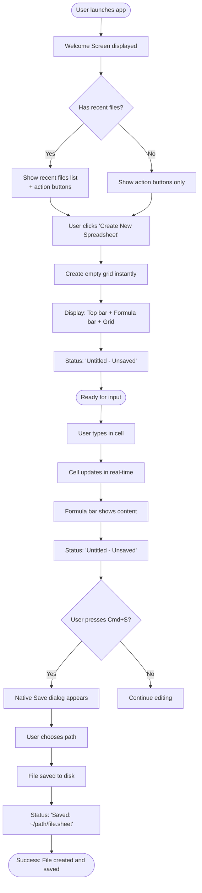
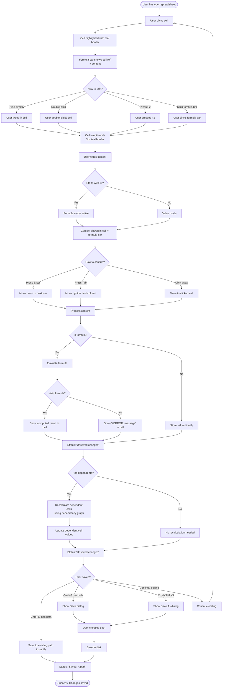
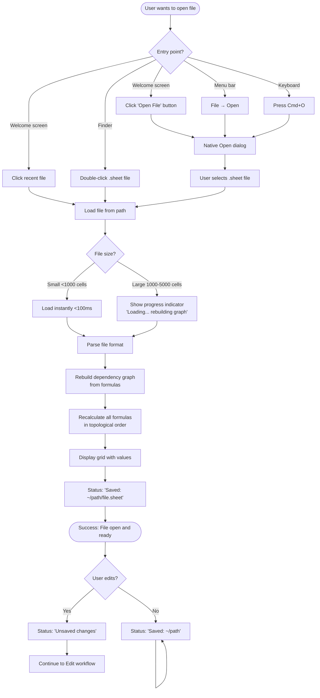
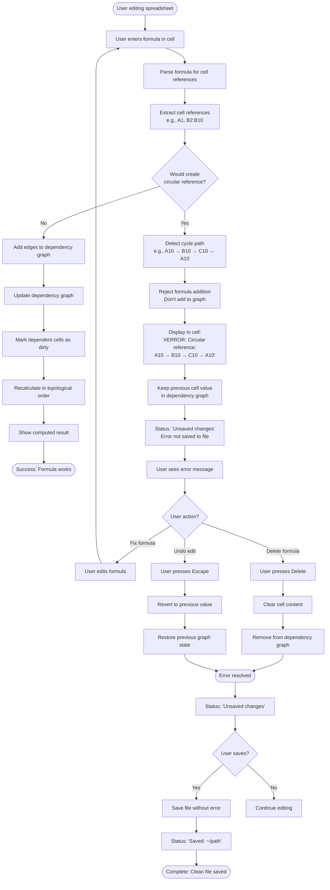

# UX Design Specification spreadsheet

**Author:** Yaron
**Date:** 2026-02-14

---

## Executive Summary

### Project Vision

GoSheet is a native macOS spreadsheet application that prioritizes speed, reliability, and trust over feature bloat. The project converts an existing web-based spreadsheet app to a native macOS application using Wails v3, solving critical file operation limitations while maintaining all existing functionality. The core value proposition is "lightweight, fast spreadsheet for macOS" - launching in under 1 second, handling 5,000+ cells efficiently, and providing crystal-clear file status that users can trust. This is a brownfield migration maintaining dual-mode architecture: native builds for users, web mode for comprehensive Playwright testing.

### Target Users

**Primary Audience:** Developers and technical users who are frustrated with Excel's slow launch times (30+ seconds) and bloated feature set when they just need quick calculations or data manipulation.

**Key Personas:**

1. **Sarah (First-Time User)** - Data scientist who needs instant launch and fast calculations for ad-hoc analysis. Values speed and simplicity over advanced features.

2. **Marcus (Power User)** - Financial analyst building complex models with 5,000+ cells and 1,000+ formulas with deep dependency chains. Needs reliability, smart recalculation, and clear error messages when things go wrong.

3. **Elena (Migration User)** - Project manager with years of CSV data who needs easy import/export workflows and clear guidance on data-only limitations.

**User Characteristics:**
- High technical literacy (comfortable with keyboard shortcuts, file paths, formula syntax)
- Desktop-focused workflow (macOS only for MVP)
- Single-user, offline work (no collaboration requirements)
- Value speed, trust, and reliability over feature richness

### Key Design Challenges

1. **File Status Transparency (Core Problem)**
   - Users must always know: "Is my work saved?" and "Where is my file?"
   - Challenge: Balancing clarity without cluttering the interface
   - Must be visible at a glance, never ambiguous
   - Solving the fundamental problem that motivated this native migration

2. **Performance Perception**
   - Users expect instant feedback (<50ms interactions, <1s launch)
   - Challenge: Large files (5K+ cells) need progress indicators without feeling slow
   - Must maintain "lightweight and fast" brand promise even during heavy operations

3. **Error Communication**
   - Two distinct error types: cell-level (formulas) and operation-level (file I/O)
   - Challenge: Making errors clear and actionable without being alarming
   - Circular references, empty cell refs, file errors all need distinct, helpful messaging

4. **Native macOS Expectations**
   - Users expect standard macOS patterns (Cmd+S, native dialogs, menu bar)
   - Challenge: Meeting macOS HIG while maintaining spreadsheet-specific UX
   - Must feel like a "real" Mac app, not a web wrapper

### Design Opportunities

1. **Welcome Screen as Productivity Hub**
   - First launch is a chance to showcase speed and simplicity
   - Recent files + quick actions = zero-friction resume work
   - Differentiates from Excel's slow, cluttered start experience

2. **Formula Bar as Power User Feature**
   - Existing feature that power users rely on
   - Opportunity: Make it more discoverable and helpful (formula hints, error preview)
   - Could add inline help or autocomplete without cluttering

3. **File Operations as Trust Builders**
   - Every save/open is a chance to reinforce reliability
   - Clear visual feedback, real paths, accurate status = user confidence
   - Subtle animations or confirmations that build trust

4. **Minimalist Grid as Focus Feature**
   - No formatting, colors, or visual clutter (out of scope for MVP)
   - Clean, distraction-free workspace for data and formulas
   - Emphasizes speed and clarity over feature bloat

---

## Core User Experience

### Defining Experience

The core experience of GoSheet centers on **file status transparency as the foundation of trust**. While cell editing and formula evaluation are the primary user actions, the defining characteristic that sets GoSheet apart is that users always know exactly where their file is and whether their work is saved. This solves the fundamental problem that motivated the native migration: the web version's browser File API limitations created confusion and eroded user confidence.

The core user loop is: **Edit cells with confidence that work won't be lost**. Every interaction reinforces this through:
- Always-visible file status showing real paths (e.g., "Saved: ~/Documents/budget.sheet")
- Instant feedback on save operations (native dialogs, immediate status updates)
- Clear unsaved change indicators that appear immediately on edit
- Reliable formula evaluation that never crashes or produces wrong results

If we nail file status transparency, everything else follows - users will trust the app enough to experiment with complex formulas, work with large datasets, and rely on it for important work.

### Platform Strategy

**Platform:** Native macOS desktop application (macOS 11+ Big Sur, Universal binary for Intel + Apple Silicon)

**Interaction Model:**
- Primarily mouse/keyboard input (desktop workflow)
- Keyboard shortcuts are first-class citizens (Cmd+S, Cmd+N, arrow keys, Tab, Enter)
- Single window, single spreadsheet at a time (MVP scope)
- Desktop-sized displays with full keyboard assumed

**Platform-Specific Capabilities:**
- **Native macOS dialogs** - The core differentiator from web version (Save, Open, Import, Export)
- **Menu bar integration** - Standard File, Edit, Help menus following macOS HIG
- **Dock integration** - Recent files accessible from dock menu, custom app icon
- **File associations** - Double-click .sheet files to open in app
- **Keyboard shortcuts** - Follow macOS conventions (Cmd+S, Cmd+W, Cmd+Q, etc.)

**Offline & Local:**
- 100% offline operation (no network transmission per NFR-S1)
- All data stays on user's disk under their control
- No cloud sync, no collaboration, no account creation (MVP)
- Privacy by design - data never leaves the user's machine

### Effortless Interactions

**Zero-Thought Actions:**
1. **Launching the app** - Sub-second launch, instant grid display, no loading spinners
2. **Saving work** - Cmd+S is muscle memory, works instantly, shows real path immediately
3. **Checking file status** - Always visible, always accurate, never requires user action
4. **Navigating cells** - Arrow keys, Tab, Enter feel instant (<50ms response)
5. **Seeing formula results** - Type formula, press Enter, see result immediately

**Automatic Behaviors:**
- Formula recalculation (only affected cells, using dependency tracking)
- Circular reference detection (errors shown immediately, app doesn't freeze)
- Recent files tracking (automatically maintained for welcome screen and dock)
- Window state persistence (size/position remembered)

**Eliminated Steps vs. Competitors:**
- No account creation (unlike Google Sheets)
- No "Save As" confusion for first save (native dialog handles it)
- No export-then-save workflow (CSV export is direct)
- No loading spinners for small files (instant display)
- No 30-second launch wait (unlike Excel)

**Delight Opportunity:**
File operations that "just work" like every other Mac app - native Save dialog appears instantly, file status updates with real path, no confusion, no temp files. Users think: "Finally, a spreadsheet that saves like it should."

### Critical Success Moments

**"This is Better" Moments:**
1. **First launch** - "Wow, it actually launched in under a second" (vs. Excel's 30s wait)
2. **First save** - "I can see exactly where my file is saved, with a real path" (vs. web version confusion)
3. **First large formula** - "It calculated 1,000 cells instantly and didn't crash" (vs. Excel crashes)
4. **First error** - "The circular reference error is clear and helpful, not cryptic" (vs. vague errors)

**User Success Milestones:**
- Completed a calculation (entered data, wrote formula, got correct result)
- Saved important work (file status shows "Saved: ~/Documents/budget.sheet" with confidence)
- Imported CSV data (brought in 500 rows, added formulas, saved as .sheet)
- Recovered from error (fixed circular reference, understood clear error message)

**Critical Failure Points (Must Never Happen):**
1. **File save fails silently** - User thinks work is saved but it's not → CATASTROPHIC
2. **File status shows wrong information** - Says "Saved" but file isn't written → TRUST DESTROYED
3. **App crashes on large file** - User loses work, doesn't trust app → GAME OVER
4. **Formula gives wrong result** - User makes business decision on bad data → UNACCEPTABLE

**Make-or-Break User Flows:**
1. **New → Edit → Save → Close → Reopen** - Complete file lifecycle must work perfectly
2. **Open → Edit → See unsaved indicator → Save → See saved indicator** - File status accurate at every step
3. **Type formula → See result → Edit cell → See recalculation** - Formula engine must be reliable
4. **Create circular reference → See error → Fix → See success** - Error handling must be clear

**First-Time User Success (Sarah's Journey):**
- Welcome screen with clear options (Create New, Open, Import CSV)
- First cell edit with instant response, formula bar shows input
- First save with native dialog, chooses path, sees "Saved: ~/Documents/Q1-revenue.sheet"
- First close with confidence that work is saved

The first save is THE critical moment - if that works perfectly, user trusts the app for all future work.

### Experience Principles

1. **Trust Through Transparency**
   - File status is always visible, always accurate, never ambiguous
   - Users should never wonder "is my work saved?" or "where is my file?"
   - Real file paths, not temp files or browser downloads
   - Clear error messages that explain what happened and how to fix it

2. **Speed as a Feature**
   - Launch in <1 second, display grid instantly
   - Interactions feel immediate (<50ms response)
   - No unnecessary loading spinners or progress bars for small operations
   - "Lightweight and fast" is not just marketing - it's the core experience

3. **Native Mac App, Not a Web Wrapper**
   - Standard macOS patterns: Cmd+S saves, native dialogs, menu bar
   - Keyboard shortcuts follow macOS conventions
   - Feels like a "real" Mac app, not a browser in disguise
   - Leverages macOS capabilities (dock, file associations, recent files)

4. **Reliability Over Features**
   - Never crash, never lose data, never corrupt files
   - Handle 5,000+ cells without breaking
   - Smart recalculation (only affected cells) for performance
   - Circular reference detection prevents infinite loops
   - Quality over quantity - do fewer things perfectly

5. **Effortless File Operations**
   - Saving should be as simple as any other Mac app
   - No multi-step export workflows (direct CSV export)
   - No account creation or cloud complexity
   - Files stay on user's disk, under their control

---

## Desired Emotional Response

### Primary Emotional Goals

**Confidence through transparency** is the primary emotional goal for GoSheet. Users feel confident because they always know exactly where their file is and whether their work is saved. This confidence is built through:

- Always-visible file status showing real paths (e.g., "Saved: ~/Documents/budget.sheet")
- Immediate feedback on all file operations (save, open, close)
- Clear, actionable error messages that explain what happened and how to fix it
- Reliable formula evaluation that produces correct results consistently

This confidence enables users to trust the app with important work, experiment with complex formulas without fear of data loss, and rely on GoSheet as their go-to tool for spreadsheet tasks.

**Secondary emotional goals** that support the primary goal:

- **Trust** - Built through consistent behavior, accurate file status, graceful error handling, and never losing data
- **Efficiency** - Instant launch (<1s), immediate interactions (<50ms), smart recalculation, keyboard-first design
- **Calm** - Minimalist interface, predictable behavior, non-alarming errors, no anxiety about data safety
- **Control** - Data stays local on user's disk, user chooses save locations, no account required, offline operation
- **Relief** - Finally, a spreadsheet that "just works" like a real Mac app with native file operations

### Emotional Journey Mapping

**First Discovery (Curious → Hopeful):**
- **Curious** - "A lightweight spreadsheet for Mac? Let me try it"
- **Skeptical** - "Can it really launch in under a second?"
- **Hopeful** - "Maybe this will be better than Excel"

**Core Experience - Cell Editing (Focused → Confident):**
- **Focused** - Clean, minimal interface lets them concentrate on data
- **Confident** - Formula bar shows exactly what they typed, results appear instantly
- **In control** - Keyboard shortcuts work as expected (Cmd+S, arrow keys, Tab)
- **Trusting** - File status always shows current state, no ambiguity

**Core Experience - File Operations (Reassured → Relieved):**
- **Reassured** - Native macOS dialog appears (familiar pattern)
- **Confident** - Real file path shown immediately after save
- **Relieved** - "Finally, I know where my file is"

**Task Completion (Accomplished → Satisfied):**
- **Accomplished** - "I got my calculation done quickly"
- **Confident** - "I know my work is saved at ~/Documents/budget.sheet"
- **Satisfied** - "That was effortless, no friction"
- **Trusting** - "I can rely on this app for important work"

**Error Handling (Informed → Empowered):**
When errors occur (circular reference, empty cell ref, file I/O error):
- **Informed, not alarmed** - Clear error message explains what happened
- **Empowered** - Error message tells them how to fix it
- **Trusting** - App didn't crash or lose data, it handled the error gracefully
- **Confident** - "I understand what went wrong and how to fix it"

**Avoid during errors:**
- Panic ("Did I lose my work?")
- Confusion ("What does this cryptic error mean?")
- Frustration ("The app crashed and I have to start over")

**Return Usage (Eager → Satisfied):**
- **Eager** - "This is my go-to tool for quick calculations"
- **Confident** - "I trust this app with important work"
- **Efficient** - Recent files in welcome screen = zero friction to resume work
- **Satisfied** - "This just works, every time"

### Micro-Emotions

**Critical micro-emotional states ranked by importance:**

1. **Confidence (vs. Confusion)** - THE critical micro-emotion
   - Users must feel confident about: where files are saved, whether work is saved, what formulas are doing, what errors mean
   - **Avoid confusion** about: file locations, save status, error meanings (the core problem being solved)

2. **Trust (vs. Skepticism)** - Foundation for adoption
   - Users trust the app because: file status is always accurate, app never crashes or loses data, errors are handled gracefully, performance is consistent
   - **Avoid skepticism** about: "Can I really trust this with important work?"

3. **Efficiency (vs. Frustration)** - Brand promise ("lightweight, fast")
   - Users feel efficient when: app launches instantly, interactions are immediate, no unnecessary loading spinners, keyboard shortcuts work as expected
   - **Avoid frustration** from: waiting, lag, unexpected behavior

4. **Calm (vs. Anxiety)** - Supports focus and productivity
   - Users feel calm because: clean interface with no visual clutter, no unexpected popups, file status is always visible, errors are clear not alarming
   - **Avoid anxiety** about: "Did I lose my work?" "Where did my file go?"

5. **Control (vs. Helplessness)** - Privacy and ownership value proposition
   - Users feel in control because: files stay on their disk, they choose where to save, no account required, offline operation
   - **Avoid helplessness** from: "I can't find my file" "I can't work offline"

### Design Implications

**Emotion-to-Design Connections:**

**Confidence (vs. Confusion):**
- Always-visible file status UI element showing "Saved: ~/path" or "Unsaved changes"
- Real file paths displayed (e.g., "~/Documents/budget.sheet"), not temp files
- Immediate feedback - status updates instantly on save/edit
- Clear error messages - "#ERROR: Circular reference: A1 → B1 → A1" (not "Error 0x8004")
- Formula bar always shows what user typed, not just computed result

**Trust (vs. Skepticism):**
- Native macOS dialogs for Save/Open (familiar patterns users already trust)
- No silent failures - if save fails, show clear error with FILE_WRITE_ERROR code
- Graceful error handling - circular refs show error, don't crash app
- Consistent performance - always fast, never unexpectedly slow
- Progress indicators only for truly long operations (>500ms), with accurate progress

**Efficiency (vs. Frustration):**
- Sub-second launch - no splash screen, instant grid display
- Instant interactions - <50ms response to clicks, keystrokes
- Smart recalculation - only affected cells, not entire spreadsheet
- Keyboard-first design - all actions accessible via shortcuts (Cmd+S, Cmd+N, arrow keys)
- No unnecessary steps - CSV export is direct, not "export then save"

**Calm (vs. Anxiety):**
- Minimalist grid - no formatting, colors, or visual clutter (out of scope for MVP)
- Predictable behavior - standard macOS patterns, no surprises
- Non-alarming errors - clear messages, not red warning dialogs
- Persistent file status - always visible, never hidden
- No interruptions - no popups unless user-initiated (Save dialog, etc.)

**Control (vs. Helplessness):**
- User chooses save location via native dialog with full file system access
- Local-only storage - no cloud, no sync, data stays on disk
- No account required - launch and use immediately
- Offline operation - works without internet
- Standard file format - .sheet files are portable, not vendor-locked

**Interactions that Create Negative Emotions (MUST AVOID):**
- Ambiguous file status - "Saved" when file isn't actually written → DESTROYS TRUST
- Silent save failures - user thinks work is saved but it's not → CATASTROPHIC
- Unclear error messages - "Error" without explanation → CONFUSION
- Unexpected slowness - lag on simple operations → FRUSTRATION
- Hidden file locations - temp paths or unclear save locations → CONFUSION
- Crashes on large files - data loss → TRUST DESTROYED

**Moments of Delight:**
- First launch speed - "Wow, it really does launch in under a second!"
- First save - "I can actually see where my file is saved!"
- Large file handling - "It handled 5,000 cells without crashing!"
- Clear error messages - "Finally, an error I can understand and fix!"
- Recent files - "My recent work is right here in the welcome screen!"

### Emotional Design Principles

1. **Always Be Transparent**
   - File status is always visible and always accurate
   - Show real paths, not abstractions or temp files
   - Clear error messages that explain what happened and how to fix it
   - Never hide important information from users

2. **Build Trust Through Consistency**
   - Predictable behavior using standard macOS patterns
   - Reliable performance - always fast, never unexpectedly slow
   - Graceful error handling - never crash, never lose data
   - Accurate feedback - if we say "Saved", it's actually saved

3. **Respect User Time**
   - Launch instantly, respond immediately
   - No unnecessary loading spinners or progress bars
   - Smart recalculation (only affected cells)
   - Keyboard shortcuts for all common actions

4. **Create Calm, Not Anxiety**
   - Minimalist design with no visual clutter
   - Non-alarming error messages
   - Predictable behavior with no surprises
   - Persistent file status (no need to check)

5. **Give Users Control**
   - Data stays on their disk, under their control
   - User chooses where to save (native dialogs)
   - No account, no cloud, no vendor lock-in
   - Offline operation (no internet dependency)

**Emotional Differentiation from Competitors:**
- **vs. Excel**: Relief from slow launch (30s → <1s), confidence from not crashing on large files
- **vs. Google Sheets**: Control from local storage, calm from privacy, efficiency from offline operation
- **vs. Other lightweight spreadsheets**: Trust from accurate file status with real paths, confidence from native Mac integration

---

## UX Pattern Analysis & Inspiration

### Inspiring Products Analysis

**1. macOS Native Apps (Finder, TextEdit, Preview, Calculator)**

**UX Excellence:**
- **Instant launch** - No splash screens, just open and work
- **Native file operations** - Save/Open dialogs that users already understand and trust
- **Predictable behavior** - Follow macOS HIG, keyboard shortcuts work as expected (Cmd+S, Cmd+W, Cmd+Q)
- **Minimal UI** - Clean, focused interfaces without feature bloat
- **Reliable** - Never crash, never lose data, always consistent
- **Real file paths** - Window titles show actual paths, status is transparent

**Key Success Factors:**
- **Trust** - Users know exactly how these apps work, no surprises
- **Efficiency** - No learning curve, muscle memory from other Mac apps works here
- **Transparency** - File paths are real, status is accurate, no abstraction layers
- **Zero onboarding** - Users already know how to use them (macOS conventions)

**Specific Patterns:**
- Menu bar with File, Edit, View, Help in standard locations
- Window title shows file name/path
- Edited indicator (dot in close button when unsaved)
- Native controls (standard macOS buttons, text fields, dialogs)
- System fonts (San Francisco) for consistency
- Clear error dialogs with specific reasons
- Drag-and-drop support

**2. Note-Taking Apps (Notion, Bear, Obsidian)**

**UX Excellence:**
- **Fast, responsive** - Instant search, quick navigation, no lag
- **Clean, minimal interface** - Focus on content, not chrome
- **Keyboard shortcuts** - Power users can work without mouse
- **File status clarity** - Users know when work is saved (especially Obsidian with local files)
- **Recent files/quick access** - Easy to resume work
- **Auto-save** - Never worry about saving (always saved)

**Key Success Factors:**
- **Speed** - Launch quickly, respond immediately
- **Simplicity** - Not overwhelming with features
- **Trust** - Clear save status (especially local-first apps like Obsidian)
- **Focus** - Minimal chrome, hide UI when not needed

**Specific Patterns:**
- Sidebar with recent files, folders, tags (can be hidden)
- Search-first navigation (Cmd+K or Cmd+P)
- Instant search with results as you type
- Markdown shortcuts for quick formatting
- Clean typography with readable fonts and good line spacing
- Dark mode support
- Auto-save with clear status indicators ("Saving...", "Saved", "Offline")
- Version history for recovery

### Transferable UX Patterns

**Navigation Patterns:**
- **Menu bar with standard items** (from macOS apps) → File, Edit, Help in expected locations for GoSheet
- **Recent files in welcome screen** (from note-taking apps) → Quick access to resume work on launch
- **Keyboard-first navigation** (from both) → Cmd+shortcuts for all actions (Save, Open, New, Close, Quit)

**Interaction Patterns:**
- **Instant launch** (from both) → <1s launch, no splash screen, instant grid display for GoSheet
- **Native file dialogs** (from macOS apps) → Save/Open with familiar macOS patterns
- **Always-visible status** (from note-taking apps) → File save status always shown in GoSheet UI
- **Minimal chrome** (from both) → Focus on spreadsheet grid, not UI elements

**Visual Patterns:**
- **Clean, minimal design** (from both) → No visual clutter, focus on data in grid
- **Native macOS controls** (from macOS apps) → Standard buttons, dialogs, fonts for GoSheet
- **Subtle feedback** (from both) → Gentle animations, clear state changes (not flashy)
- **System font** (from macOS apps) → San Francisco for consistency with macOS

**File Operation Patterns:**
- **Real file paths in UI** (from macOS apps) → Show ~/Documents/budget.sheet in GoSheet, not abstractions
- **Edited indicator** (from macOS apps) → Dot in close button or status text for unsaved changes
- **Explicit save control** (from macOS apps) → User controls when changes are permanent (Cmd+S)

**Auto-Save Consideration (Phase 2):**
- **Auto-save pattern** (from note-taking apps) → Deferred to Phase 2 after Undo/Redo implementation
- **Why deferred**: Without Undo, auto-save is dangerous - users can't recover from mistakes that are immediately saved to disk
- **MVP approach**: Explicit save only (Cmd+S) - users can experiment safely, close without saving to discard mistakes
- **Phase 2 approach**: Auto-save after initial path selection, combined with Undo/Redo for safety + convenience

### Anti-Patterns to Avoid

**1. Ambiguous Save Status (Excel Online, Google Sheets)**
- **Anti-pattern**: "Saving..." that never completes, or unclear sync status
- **Why avoid**: Creates anxiety, users don't know if work is safe
- **GoSheet approach**: Clear binary status - "Saved: ~/path" or "Unsaved changes"

**2. Hidden File Locations (Web apps, browser downloads)**
- **Anti-pattern**: Files saved to "Downloads" or temp folders without clear indication
- **Why avoid**: Users can't find their work later, creates confusion and distrust
- **GoSheet approach**: Always show real file path (~/Documents/budget.sheet)

**3. Silent Save Failures (Many apps)**
- **Anti-pattern**: App says "Saved" but file write actually failed
- **Why avoid**: Catastrophic trust violation, data loss, destroys user confidence
- **GoSheet approach**: If save fails, show clear error with FILE_WRITE_ERROR code and explanation

**4. Cryptic Error Messages (Excel, older apps)**
- **Anti-pattern**: "Error 0x80004005" or "Invalid cell reference" without explanation
- **Why avoid**: Users don't know what went wrong or how to fix it
- **GoSheet approach**: "#ERROR: Circular reference: A1 → B1 → A1" with clear explanation

**5. Feature Bloat (Excel, LibreOffice)**
- **Anti-pattern**: Overwhelming UI with ribbons, toolbars, panels, hundreds of features
- **Why avoid**: Slows down app, distracts from core task, intimidates users, increases crash risk
- **GoSheet approach**: Minimal UI, focus on grid and formula bar, "Reliability Over Features"

**6. Slow Launch (Excel, heavy apps)**
- **Anti-pattern**: 30+ second launch with splash screens and loading bars
- **Why avoid**: Breaks "quick calculation" use case, frustrates users, violates speed promise
- **GoSheet approach**: <1 second launch, instant grid display, no splash screen

**7. Auto-Save Without Undo (Some note apps)**
- **Anti-pattern**: Auto-saves mistakes immediately with no recovery mechanism
- **Why avoid**: Users can't experiment safely, fear of corrupting file, violates user control
- **GoSheet approach**: Explicit save in MVP, auto-save only after Undo/Redo in Phase 2

**8. Non-Native File Dialogs (Electron apps, web wrappers)**
- **Anti-pattern**: Custom file pickers that don't match OS patterns
- **Why avoid**: Unfamiliar, less trustworthy, missing OS features (recent locations, favorites)
- **GoSheet approach**: Native macOS dialogs for all file operations (Save, Open, Import, Export)

### Design Inspiration Strategy

**What to Adopt:**

1. **Native macOS patterns** (from Finder, TextEdit, Preview)
   - **Why**: Supports trust, familiarity, zero learning curve
   - **Specific patterns**: Native dialogs, menu bar, keyboard shortcuts (Cmd+S/O/N/W/Q), window chrome with file path
   - **Implementation**: Use Wails built-in APIs for all macOS integration

2. **Instant launch and response** (from Calculator, native apps)
   - **Why**: Aligns with "Speed as a Feature" principle and efficiency goal
   - **Specific patterns**: No splash screen, <1s launch, <50ms interactions, instant grid display
   - **Implementation**: Optimized startup, minimal initialization, smart recalculation

3. **Always-visible file status** (from note-taking apps)
   - **Why**: Supports "Trust Through Transparency" core goal
   - **Specific patterns**: Persistent status bar showing real path and save state
   - **Implementation**: Always-visible UI element, updates immediately on save/edit

4. **Minimal, focused UI** (from both macOS apps and note-taking apps)
   - **Why**: Aligns with "Create Calm, Not Anxiety" principle
   - **Specific patterns**: Clean grid, no visual clutter, focus on content, no formatting options (out of scope)
   - **Implementation**: Minimalist design, no ribbons/toolbars, just grid and formula bar

5. **Keyboard-first design** (from all inspiring apps)
   - **Why**: Supports efficiency, power user workflows
   - **Specific patterns**: Cmd+shortcuts for all actions, arrow key navigation, Tab/Enter for cell movement
   - **Implementation**: All actions accessible via keyboard, follows macOS conventions

**What to Adapt:**

1. **Recent files pattern** (from note-taking apps)
   - **Adapt for**: Welcome screen on launch (not persistent sidebar)
   - **Modify for**: macOS dock menu integration (right-click app icon shows recent files)
   - **Implementation**: Store recent files list, display in welcome screen and dock menu

2. **Auto-save pattern** (from note-taking apps)
   - **Adapt for**: Phase 2 only, after Undo/Redo is implemented
   - **Modify for**: Explicit save in MVP to maintain user control and safety
   - **Rationale**: Without Undo, auto-save is dangerous - users can't recover from mistakes immediately saved to disk

3. **Search/quick navigation** (from note-taking apps)
   - **Adapt for**: Not needed in MVP (single spreadsheet at a time, single window)
   - **Modify for**: Could add Cmd+F for find-in-cells in future phase
   - **Implementation**: Deferred to future enhancement

**What to Avoid:**

1. **Feature bloat** (from Excel, LibreOffice)
   - **Conflicts with**: "Speed as a Feature", "Reliability Over Features" principles
   - **Why**: Slows launch, complicates UI, increases crash risk, distracts from core task
   - **GoSheet stance**: Do fewer things perfectly, not hundreds of features poorly

2. **Auto-save without Undo** (from some note apps)
   - **Conflicts with**: "Trust Through Transparency", user control, safety
   - **Why**: Dangerous without recovery mechanism - users can't undo mistakes saved to disk
   - **GoSheet stance**: Explicit save in MVP, auto-save only after Undo/Redo in Phase 2

3. **Custom file dialogs** (from Electron apps)
   - **Conflicts with**: "Native Mac App, Not a Web Wrapper" principle
   - **Why**: Less trustworthy, unfamiliar patterns, missing OS features (recent locations, favorites)
   - **GoSheet stance**: Always use native macOS dialogs via Wails APIs

4. **Ambiguous status indicators** (from web apps)
   - **Conflicts with**: "Trust Through Transparency" core goal
   - **Why**: Creates anxiety, users don't know if work is safe, erodes confidence
   - **GoSheet stance**: Clear binary status - "Saved: ~/path" or "Unsaved changes"

5. **Cryptic error messages** (from older apps)
   - **Conflicts with**: "Always Be Transparent" emotional principle
   - **Why**: Confuses users, doesn't help them fix problems, creates frustration
   - **GoSheet stance**: Clear, actionable errors - "#ERROR: Circular reference: A1 → B1 → A1"

**Strategy Summary:**

This inspiration strategy guides GoSheet to be **fast, transparent, and trustworthy** by adopting proven native macOS patterns while avoiding common pitfalls that erode user trust. The focus is on doing core spreadsheet functionality perfectly with native file operations, rather than competing on feature count.

---

## Design System Foundation

### Design System Choice

**Selected System: Pico.css (Classless CSS Framework)**

Pico.css is a lightweight, classless CSS framework that provides modern, professional styling without requiring build tools or class names. It works perfectly with vanilla HTML/JavaScript and provides a clean, polished aesthetic that balances GoSheet's "lightweight and fast" promise with professional visual design.

**Key Characteristics:**
- **Size**: ~10KB gzipped (minimal impact on load time)
- **Style**: Modern, clean, professional
- **Approach**: Semantic HTML styling (no classes required)
- **Themes**: Built-in light and dark mode support
- **Components**: Tables, forms, buttons, modals, typography
- **Integration**: Drop-in CSS file, no build tools needed

### Rationale for Selection

**1. No Build Tools Required**
- Drop-in CSS file, works with vanilla HTML/JavaScript
- Aligns with architecture decision (no npm, no build pipeline per architecture.md)
- Instant integration, no configuration needed
- Maintains simplicity of existing frontend codebase

**2. Speed and Performance**
- Only ~10KB gzipped (loads instantly)
- No JavaScript required (pure CSS)
- Supports "Speed as a Feature" experience principle
- Won't slow down <1s launch time requirement (NFR-P1)
- Minimal parsing and rendering overhead

**3. Professional Polish Without Complexity**
- More polished than native browser defaults
- Not as dull as pure system styling
- Provides modern, clean aesthetic
- Balances "lightweight" with "professional"
- Avoids "brutalist" or overly minimal look

**4. Spreadsheet-Friendly Components**
- Excellent table styling (base for grid cells)
- Form controls (for formula bar, dialogs)
- Buttons (for toolbar: New, Save, Open, Import, Export)
- Modal dialogs (for CSV preview, error messages, warnings, help screens)
- Status indicators (for file status display)
- Typography (for cell content, headers)

**5. Dark Mode Support**
- Built-in light and dark themes
- Reduces eye strain for long spreadsheet sessions
- Aligns with modern macOS apps (system dark mode)
- Users can choose preference (respects system setting)

**6. Easy Customization**
- CSS variables for colors, spacing, fonts
- Can override with custom CSS for spreadsheet-specific needs
- Can use San Francisco font for more native Mac feel
- Maintains brand flexibility without framework lock-in

**7. Accessibility Built-In**
- Good contrast ratios
- Semantic HTML support
- Keyboard navigation styles
- Screen reader friendly
- Aligns with NFR-U1 (macOS HIG compliance)

### Implementation Approach

**Phase 1: Basic Integration**

```html
<!-- In frontend/index.html -->
<link rel="stylesheet" href="https://cdn.jsdelivr.net/npm/@picocss/pico@2/css/pico.min.css">
<link rel="stylesheet" href="styles.css"> <!-- Custom overrides -->
```

**Integration steps:**
1. Add Pico.css CDN link to `frontend/index.html` (before existing `styles.css`)
2. Existing custom CSS in `styles.css` will override Pico defaults where needed
3. Test in both light and dark mode
4. Verify no conflicts with existing spreadsheet grid styling

**Phase 2: Font Customization**

```css
/* In frontend/styles.css */
:root {
  /* Use macOS system font for native feel */
  --font-family: -apple-system, BlinkMacSystemFont, "San Francisco", "Segoe UI", sans-serif;
  
  /* Optional: Customize colors for brand */
  --primary: #007AFF; /* macOS blue */
  --secondary: #5AC8FA; /* macOS light blue */
  
  /* Adjust spacing for spreadsheet density */
  --spacing: 0.5rem;
}
```

**Phase 3: Component-Specific Styling**

Pico provides base styles, custom CSS adds spreadsheet-specific features:

- **Grid cells**: Use Pico table styles as base, customize for spreadsheet density, selection states, hover effects
- **Formula bar**: Use Pico input styles, add spreadsheet-specific features (cell reference display, formula syntax)
- **Toolbar buttons**: Use Pico button styles, add icons for actions (New, Open, Save, Import, Export)
- **File status**: Use Pico badge/tag styles for status indicators ("Saved: ~/path", "Unsaved changes")
- **Dialogs**: Use Pico modal styles for CSV preview, error messages, unsaved changes warnings, help screens
- **Welcome screen**: Custom layout using Pico typography and button styles

### Customization Strategy

**What to Keep from Pico.css:**
- **Typography** - Clean, readable fonts and line heights
- **Form controls** - Input fields, buttons, dropdowns
- **Table base styles** - Borders, padding, hover states
- **Modal dialogs** - Overlay, card styling, close buttons
- **Color system** - CSS variables for theming
- **Dark mode** - Automatic theme switching
- **Code/kbd elements** - Monospace font, keyboard shortcut display

**What to Customize:**
- **Font family** - Override with San Francisco for native Mac feel
- **Grid density** - Tighter spacing for spreadsheet cells (more data visible)
- **Primary colors** - Adjust to macOS blue (#007AFF) for native consistency (optional)
- **Formula bar** - Custom styling for cell reference display and formula editing
- **Status indicators** - Custom styling for file status display (always visible, clear)
- **Button sizes** - Adjust for toolbar density

**What to Add Custom (Not in Pico):**
- **Spreadsheet grid** - Custom CSS for cell borders, selection highlight, active cell indicator, hover states
- **Cell editing** - Custom styling for active cell editing state (border, focus ring)
- **Error display** - Custom styling for #ERROR messages in cells (red text, clear formatting)
- **Progress indicators** - Custom styling for large file operations (loading bar, percentage)
- **Welcome screen** - Custom layout for recent files list and action buttons
- **Row/column headers** - Custom styling for grid headers (fixed position, background)
- **Help modals** - Function reference with search, keyboard shortcuts table
- **Code/formula display** - Monospace font for formula examples in help
- **Keyboard shortcut badges** - Styled `<kbd>` elements for key names (Cmd, S, etc.)

**Help and Documentation Components:**

**1. Function Reference (High Priority - MVP)**
- **What**: List of all available functions with syntax and examples
- **Where**: Accessible from Help menu (Help → Function Reference) or Cmd+?
- **Format**: Modal dialog with searchable list
- **Content**:
  - **Numeric functions**: SUM, AVG, MIN, MAX, COUNT
  - **String functions**: CONCAT, UPPER, LOWER, LEN, LEFT, RIGHT, MID
  - **Operators**: +, -, *, /, %, =, !=, <, >, <=, >=
  - Each with: Syntax, description, example, return type
- **Implementation**: Use Pico modal styles with custom scrollable content, search input
- **Layout**: Two-column (function list on left, details on right) or single scrollable list

**2. Keyboard Shortcuts Reference (Medium Priority - MVP)**
- **What**: List of all keyboard shortcuts
- **Where**: Help menu (Help → Keyboard Shortcuts)
- **Format**: Modal dialog with grouped shortcuts
- **Content**:
  - **File operations**: Cmd+N, Cmd+O, Cmd+S, Cmd+Shift+S, Cmd+W, Cmd+Q
  - **Editing**: Cmd+X, Cmd+C, Cmd+V, Cmd+A, Delete, Backspace
  - **Navigation**: Arrow keys, Tab, Enter, Shift+Tab
  - **Formula bar**: Click or F2 to edit
- **Implementation**: Use Pico modal with table layout, styled `<kbd>` elements

**3. About Dialog (Low Priority - MVP)**
- **What**: App version, copyright, brief description
- **Where**: Help menu (Help → About GoSheet)
- **Format**: Simple modal dialog
- **Content**: App name, version, "Lightweight, fast spreadsheet for macOS", copyright
- **Implementation**: Use Pico modal with centered content

**4. First-Run Tips (Future - Phase 2)**
- **What**: Brief tooltip or overlay on first launch
- **Where**: Welcome screen or first spreadsheet view
- **Content**: "Tip: Press Cmd+S to save, Cmd+N for new spreadsheet"
- **Implementation**: Deferred to Phase 2 (not critical for MVP)

**Customization Priorities:**

1. **High Priority** (MVP blockers):
   - Spreadsheet grid cell styling
   - Formula bar styling
   - File status display
   - Toolbar buttons
   - Error message display
   - Function reference modal

2. **Medium Priority** (MVP nice-to-have):
   - Welcome screen layout
   - Dark mode refinements
   - Button icons
   - Modal dialog customization
   - Keyboard shortcuts reference

3. **Low Priority** (Post-MVP):
   - Advanced theming
   - Additional color schemes
   - Animation refinements
   - First-run tips

**Benefits of This Approach:**

✅ **Fast development** - Pico provides 80% of styling out of the box, focus on spreadsheet-specific features
✅ **Professional look** - Modern, polished aesthetic without framework overhead or complexity
✅ **Lightweight** - 10KB won't impact <1s launch time or <50ms interaction targets
✅ **Maintainable** - Simple CSS, no build tools, easy to customize and debug
✅ **Accessible** - Pico has good accessibility defaults built-in (contrast, keyboard nav)
✅ **Flexible** - Can customize as much or as little as needed, no framework lock-in
✅ **Native feel** - San Francisco font + macOS colors = feels like a real Mac app
✅ **Dark mode** - Built-in support aligns with modern macOS user expectations
✅ **Help system** - Modal dialogs support function reference and keyboard shortcuts

---

## Defining Core Experience

### The Defining Experience

**Core Interaction: "Edit spreadsheets with complete confidence that your work is safe"**

This is what users will describe to their friends:
- "It's a spreadsheet that actually shows you where your file is saved"
- "I always know if my work is saved - no confusion, no temp files"
- "It saves like a real Mac app, not a browser download"

The defining moment is when users press **Cmd+S**, see the native Save dialog (or instant save if path exists), and then see **"Saved: ~/Documents/budget.sheet"** appear immediately in the status bar. That's when they think: "I can trust this app."

**Why This Defines GoSheet:**

File status transparency builds the trust foundation that enables everything else:
- Users trust the app enough to experiment with complex formulas
- Users rely on it for important work with large datasets
- Users recommend it to others because "it just works"

If we nail file status transparency, everything else follows - the spreadsheet functionality is table stakes, but the trust is what makes GoSheet special.

### User Mental Model

**How Users Currently Solve This Problem:**

Users currently use:
1. **Excel** - Traditional desktop spreadsheet (slow launch, crashes on large files, overwhelming UI)
2. **Google Sheets** - Web-based (requires internet, privacy concerns, unclear save status with endless "Saving...")
3. **Numbers** (macOS) - Native but limited formula support, different syntax
4. **CSV + text editor** - For simple data (no formulas, manual calculations)

**Mental Model Users Bring:**

**For spreadsheets:**
- Grid of cells with rows (numbers) and columns (letters), like Excel/Sheets
- Formulas start with `=` (universal spreadsheet convention)
- Cell references (A1, B2) and ranges (A1:A10)
- Functions like SUM(), AVG() with parentheses
- Formula bar shows what's in the cell

**For file operations:**
- Save/Open like any other Mac app (Cmd+S, native dialogs)
- File status shows current file name/path
- Unsaved changes indicator (dot in close button or status text)
- Warning before closing unsaved work

**User Expectations:**

**Cell editing:**
- Click cell → type → press Enter → value appears
- Double-click or F2 → edit existing value
- Arrow keys navigate, Tab moves right, Enter moves down
- Formula bar shows what's in the cell

**File operations:**
- Cmd+S → Save dialog (if new) or instant save (if path exists)
- Cmd+O → Open dialog → file loads
- File status shows current file name/path
- Unsaved changes indicator appears on edit

**Formulas:**
- Type `=SUM(A1:A10)` → see result
- Edit A1 → see dependent cells recalculate automatically
- Invalid formula → see error message

**Potential Confusion Points:**

1. **First save** - "Where did my file go?" (if status unclear)
2. **File status** - "Is this saved or not?" (if ambiguous)
3. **Formula errors** - "What does this error mean?" (if cryptic)
4. **CSV import** - "Where are my formulas?" (data-only limitation needs clear messaging)
5. **Single window** - "Can I open two spreadsheets?" (MVP limitation, need to communicate)

**What Users Love/Hate About Current Solutions:**

**Excel:**
- ✅ Love: Familiar, powerful formulas, native file operations
- ❌ Hate: Slow launch (30s), crashes on large files, overwhelming UI with ribbons

**Google Sheets:**
- ✅ Love: Fast, accessible anywhere, auto-save
- ❌ Hate: Requires internet, unclear save status ("Saving..." never completes), privacy concerns

**Numbers (macOS):**
- ✅ Love: Native Mac app, fast, beautiful design
- ❌ Hate: Limited formula support, different syntax, can't share with Excel users

**User Shortcuts/Workarounds:**
- Keep Excel closed, only open when absolutely needed (to avoid slow launch)
- Use Google Sheets for quick calculations, export to Excel for serious work
- Use Calculator app for simple math instead of opening spreadsheet

**What Makes Solutions Feel Magical or Terrible:**

**Magical:**
- Google Sheets auto-save (never worry about saving) - but needs Undo to be safe
- Excel's formula autocomplete (helps discover functions) - future enhancement
- Numbers' beautiful templates (looks professional) - out of scope for MVP

**Terrible:**
- Excel's 30-second launch (breaks flow, kills productivity)
- Google Sheets' "Saving..." that never confirms (creates anxiety)
- Browser downloads that go to Downloads folder (confusion about file location)

### Success Criteria

**What Makes Users Say "This Just Works":**

1. **File operations are transparent**
   - Press Cmd+S → Native dialog appears (or instant save if path exists)
   - File status updates immediately: "Saved: ~/Documents/budget.sheet"
   - No confusion about where file went or if it saved

2. **App is instant**
   - Launch in <1 second (no splash screen, no waiting)
   - Grid displays immediately (no loading spinner)
   - Cell edits feel immediate (<50ms response)

3. **Formulas just work**
   - Type `=A1+B2` → press Enter → see result instantly
   - Edit A1 → see dependent cells update automatically
   - Error messages are clear: "#ERROR: Circular reference: A1 → B1 → A1"

4. **No surprises**
   - Keyboard shortcuts work as expected (Cmd+S, arrow keys, Tab)
   - Native dialogs match other Mac apps
   - Behavior is predictable and consistent

**When Users Feel Smart or Accomplished:**

**Feel smart when:**
- They write a complex formula and it works first try
- They see the formula bar showing exactly what they typed
- They understand an error message and fix it immediately
- They find their file exactly where they saved it

**Feel accomplished when:**
- Calculation is complete and result is correct
- File is saved with clear "Saved: ~/path" confirmation
- CSV data is imported and ready to work with
- Complex model with 1,000+ formulas works without crashing

**Feedback That Tells Users They're Doing It Right:**

**Visual Feedback:**
- **File status** - "Saved: ~/Documents/budget.sheet" (green checkmark) or "Unsaved changes" (orange/yellow indicator)
- **Cell selection** - Clear border around active cell
- **Formula bar** - Shows cell reference (A1) and content
- **Computed values** - Results appear in cells immediately
- **Error messages** - Clear #ERROR text in red

**Interaction Feedback:**
- **Instant response** - No lag between keypress and display (<50ms)
- **Native dialogs** - Familiar Save/Open dialogs appear
- **Status updates** - File status changes immediately on edit/save
- **Recalculation** - Dependent cells update automatically

**Performance Expectations:**
- **Launch**: <1 second (instant, no splash screen)
- **Cell interactions**: <50ms (feels immediate)
- **Formula evaluation**: Instant for simple formulas, <200ms for 250 dependent cells
- **File save**: Instant for small files, <3s for 5,000 cells with progress indicator
- **File open**: Instant for small files, <3s for 5,000 cells with progress indicator

**Automatic Behaviors:**
- **Formula recalculation** - When dependencies change, only affected cells recalculate
- **File status updates** - On every edit, save, open (no manual refresh needed)
- **Recent files tracking** - Files added to recent list on open/save automatically
- **Circular reference detection** - Errors shown immediately, app doesn't freeze
- **Formula normalization** - Cell references uppercased (a1 → A1), spaces removed

**Success Indicators:**
1. User saves file and sees real path - "Saved: ~/Documents/budget.sheet" appears immediately
2. User edits cell and sees unsaved indicator - Status changes to "Unsaved changes" instantly
3. User presses Cmd+S and sees confirmation - Status changes to "Saved: ~/path" immediately
4. User creates formula and sees result - Computed value appears in cell instantly
5. User creates error and sees clear message - "#ERROR: Circular reference: A1 → B1 → A1" explains problem

### Novel UX Patterns

**GoSheet Uses Established Patterns with Exceptional Execution:**

GoSheet intentionally avoids novel interactions to support the "Native Mac App, Not a Web Wrapper" experience principle. The innovation is in **execution quality**, not invention.

**Established Patterns Used:**

1. **Spreadsheet grid** - Standard pattern from Excel, Google Sheets, Numbers
2. **File operations** - Standard macOS pattern (Cmd+S, native dialogs)
3. **Formula syntax** - Standard spreadsheet convention (=, cell refs, functions)

**GoSheet's Innovation: Perfecting the Fundamentals**

1. **File status transparency** - Always visible, always accurate, real paths (not temp files)
2. **Native file operations** - Solving browser File API limitations
3. **Minimal UI** - Speed and reliability over feature bloat
4. **Smart recalculation** - Dependency graph, handles 5,000+ cells without crashing

**No User Education Needed** - Users already know how to use spreadsheets and Mac apps. GoSheet just does it better.

### Experience Mechanics

**1. Initiation: How Users Start**

**App Launch:**
- User double-clicks GoSheet.app in Applications folder (or dock)
- App launches in <1 second (no splash screen)
- Welcome screen appears with:
  - "Create New Spreadsheet" button (primary action)
  - "Open Existing File" button
  - "Import from CSV" button
  - Recent files list (up to 5 files with paths)

**Starting Work:**
- **New spreadsheet**: Click "Create New" → Empty grid appears instantly, status shows "Untitled - Unsaved"
- **Open file**: Click "Open" or recent file → Native dialog → File loads → Status shows "Saved: ~/path"
- **Import CSV**: Click "Import CSV" → Native dialog → Preview → Import → Status shows "Untitled - Unsaved*"

**Triggers and Invitations:**
- Clear, large action buttons on welcome screen
- Recent files list shows "your work is here, ready to resume"
- Keyboard shortcuts (Cmd+N, Cmd+O) work immediately

**2. Interaction: What Users Actually Do**

**Core Loop: Edit → See Result → Save**

**Cell Editing:**
- Click cell → Cell highlights with border
- Type value or formula → Content appears in both cell and formula bar
- Press Enter → Value/result appears, selection moves down
- Press Tab → Value/result appears, selection moves right
- Press Escape → Cancel edit, revert to previous value

**Formula Entry:**
- Click cell → Type `=` → Formula mode activated
- Type formula (e.g., `=A1+B2`) → Formula bar shows formula
- Press Enter → Result appears in cell, formula shown in formula bar when selected
- Edit dependent cell (A1) → Result cell updates automatically

**File Operations:**
- Press Cmd+S → 
  - If no path: Native Save dialog appears → User chooses location → File saves → Status: "Saved: ~/path"
  - If path exists: File saves instantly → Status: "Saved: ~/path"
- Press Cmd+O → Native Open dialog → User selects file → File loads → Status: "Saved: ~/path"
- Edit any cell → Status immediately changes to "Unsaved changes"

**Controls and Inputs:**
- **Mouse**: Click cells, click buttons, use native dialogs
- **Keyboard**: Type values/formulas, arrow keys, Tab, Enter, Cmd+shortcuts
- **Formula bar**: Click to edit, type formula, press Enter

**System Response:**
- **Instantly** (<50ms) for cell selection, navigation, typing
- **Immediately** for formula evaluation (simple formulas)
- **Quickly** (<200ms) for complex recalculations (250 cells)
- **With progress** for large operations (>500ms, show progress indicator)

**3. Feedback: How Users Know They're Succeeding**

**Visual Feedback:**

**File Status (Always Visible):**
- **"Saved: ~/Documents/budget.sheet"** - Green checkmark, real path shown
- **"Unsaved changes"** - Orange/yellow indicator, appears immediately on edit
- **"Untitled - Unsaved"** - New spreadsheet, no path yet

**Cell Feedback:**
- **Selected cell** - Clear border highlight
- **Active editing** - Different border style (thicker or different color)
- **Computed result** - Value appears in cell
- **Error** - "#ERROR: message" in red text

**Formula Bar Feedback:**
- **Cell reference** - Shows "A1" or current cell
- **Content** - Shows raw value or formula
- **Editing state** - Cursor visible, can type

**Progress Feedback:**
- **Large file operations** - Progress bar with percentage
- **Recalculation** - Brief "Calculating..." for >500ms operations
- **CSV import** - "Importing 500 rows..." with progress

**Interaction Feedback:**
- **Button press** - Visual state change (pressed, hover)
- **Dialog appearance** - Native macOS animation
- **Status update** - Smooth transition between states

**What Happens If They Make a Mistake:**

**Formula Errors (Cell-Level):**
- **Circular reference**: "#ERROR: Circular reference: A1 → B1 → A1" appears in cell (red text)
- **Empty cell ref**: "#ERROR: reference to empty cell" appears in cell
- **Invalid syntax**: "#ERROR: parse error" appears in cell
- **Division by zero**: "#ERROR: division by zero" appears in cell
- **Unknown function**: "#ERROR: unknown function: FOO" appears in cell

**File Operation Errors (System-Level):**
- **Can't save**: Alert dialog: "Cannot save file: [reason]" with FILE_WRITE_ERROR code
- **Can't open**: Alert dialog: "Cannot open file: [reason]" with FILE_READ_ERROR code
- **File not found**: Alert dialog: "File not found: [path]" with FILE_NOT_FOUND code
- **Permission denied**: Alert dialog: "Permission denied: [path]. Check file permissions in Finder."

**Accidental Data Loss Prevention:**
- **Close with unsaved changes**: Warning dialog: "You have unsaved changes. Save before closing?" 
  - Buttons: Save / Don't Save / Cancel
  - Default: Save (safest option)
- **Open file with unsaved changes**: Warning dialog: "You have unsaved changes. Save before opening?"
- **New spreadsheet with unsaved changes**: Warning dialog: "You have unsaved changes. Save before creating new?"

**Error Recovery:**
- **Formula errors**: Edit cell, fix formula, error disappears
- **File errors**: Check permissions, try different path, retry operation
- **Unsaved changes**: Choose Save to preserve work, Don't Save to discard, Cancel to continue editing

**4. Completion: How Users Know They're Done**

**After Completing Work:**
- File status shows "Saved: ~/Documents/budget.sheet" (green checkmark)
- No unsaved changes indicator
- Can close app confidently (no warning dialog)

**Successful Outcomes:**

**For calculation task:**
- Formula result is correct and displayed in cell
- File is saved with clear path shown in status
- User can close app knowing work is safe

**For file management task:**
- File is saved to chosen location (user selected via native dialog)
- File appears in recent files list
- Can reopen file from welcome screen or dock menu

**For CSV import task:**
- Data is imported into grid (all rows/columns visible)
- Status shows "Unsaved changes" (needs to save as .sheet format)
- User can add formulas and save in native format

**What's Next After Completion:**

**After saving:**
- Continue editing (status updates to "Unsaved changes" on next change)
- Close app (no warning, work is saved)
- Open another file (with warning if unsaved changes exist)

**After closing:**
- App quits gracefully
- Recent files list is updated and persisted
- Next launch shows this file in recent list on welcome screen

**Completion Indicators:**
- **Visual**: "Saved: ~/path" in green with checkmark
- **Behavioral**: Close button has no dot (no unsaved changes indicator)
- **Confidence**: User closes app without anxiety about data loss

---

## Visual Design Foundation

### Color System

**Selected Theme: Modern Clarity - Option 1**

GoSheet uses a clean, high-contrast color palette with teal primary and yellow-green success colors. This palette emphasizes clarity, precision, and trust - perfectly aligned with our emotional goals of confidence through transparency.

**Color Palette:**

**Light Mode:**
- **Primary**: `#00A896` (Teal) - Primary actions, selected cells, interactive elements
- **Primary Hover**: `#008577` (Darker teal) - Hover states for primary actions
- **Secondary**: `#6366F1` (Indigo) - Secondary actions, accents
- **Background**: `#FFFFFF` (White) - Main canvas, cell backgrounds
- **Surface**: `#F8F9FA` (Light gray) - Column/row headers, dialogs, elevated surfaces
- **Text**: `#1A1A1A` (Near black) - Primary text, cell content
- **Text Secondary**: `#6B7280` (Medium gray) - Labels, secondary information
- **Border**: `#D1D5DB` (Light gray) - Input borders, dialog borders
- **Grid Border**: `#E5E7EB` (Very light gray) - Spreadsheet grid lines
- **Success**: `#22C55E` (Yellow-green) - Saved status, success states
- **Warning**: `#F59E0B` (Amber) - Unsaved changes, warnings
- **Error**: `#EF4444` (Red) - Errors, validation failures
- **Info**: `#3B82F6` (Blue) - Informational messages

**Dark Mode:**
- **Primary**: `#14B8A6` (Bright teal) - Primary actions, selected cells
- **Primary Hover**: `#2DD4BF` (Lighter teal) - Hover states
- **Secondary**: `#818CF8` (Light indigo) - Secondary actions
- **Background**: `#111827` (Dark blue-gray) - Main canvas
- **Surface**: `#1F2937` (Lighter dark gray) - Headers, dialogs
- **Text**: `#F9FAFB` (Off-white) - Primary text
- **Text Secondary**: `#9CA3AF` (Light gray) - Labels, secondary info
- **Border**: `#374151` (Medium dark gray) - Borders
- **Grid Border**: `#374151` (Medium dark gray) - Grid lines
- **Success**: `#4ADE80` (Bright green) - Success states
- **Warning**: `#FBBF24` (Bright amber) - Warnings
- **Error**: `#F87171` (Bright red) - Errors
- **Info**: `#60A5FA` (Bright blue) - Info messages

**Semantic Color Mapping:**

**File Status Colors:**
- **Saved**: Success color with checkmark icon
- **Unsaved changes**: Warning color with dot/indicator
- **Error**: Error color with alert icon

**Cell States:**
- **Selected**: Primary color outline (2px solid)
- **Editing**: Primary color outline with thicker border (3px)
- **Error**: Error color text with red background tint (#EF444410)
- **Normal**: Text color on background

**UI Element Colors:**
- **Primary button**: Primary color background, white text
- **Secondary button**: Surface color background, text color, border
- **Danger button**: Error color background, white text
- **Disabled**: Text secondary color, reduced opacity (0.5)

**Rationale for Color Choices:**

1. **Teal primary (#00A896) vs. green success (#22C55E)**: Clear visual distinction between interactive elements and status indicators. Teal is cooler and more neutral, while yellow-green is warmer and more positive.

2. **High contrast**: All text meets WCAG AAA standards (7:1 contrast ratio minimum) for maximum readability in data-heavy contexts.

3. **Colorblind-friendly**: Teal and yellow-green are distinguishable for most types of color blindness. Error red is paired with text labels, not color alone.

4. **Dark mode adaptation**: Colors shift to higher luminance in dark mode while maintaining semantic meaning and contrast ratios.

5. **Native macOS alignment**: Color choices complement macOS system colors (SF Symbols, native controls) for cohesive integration.

**Color Usage Guidelines:**

- **Use primary color sparingly**: Only for interactive elements and selected states (buttons, selected cells, links)
- **Success color for confirmation**: File saved, operation completed, positive outcomes
- **Warning color for attention**: Unsaved changes, non-critical issues requiring awareness
- **Error color for problems**: Validation errors, formula errors, critical issues
- **Info color for guidance**: Help text, tooltips, informational messages (future)
- **Text colors for hierarchy**: Primary text for content, secondary text for labels/metadata

### Typography System

**Typeface Strategy:**

GoSheet uses native macOS system fonts exclusively for instant loading, zero performance overhead, and seamless OS integration. This aligns with our "Native Mac App, Not a Web Wrapper" principle.

**Font Families:**

**Primary Typeface (UI and Cells):**
```css
font-family: -apple-system, BlinkMacSystemFont, "Segoe UI", Roboto, Helvetica, Arial, sans-serif;
```
- **macOS**: SF Pro (San Francisco)
- **Windows**: Segoe UI
- **Linux**: Roboto
- **Fallback**: Helvetica, Arial

**Monospace Typeface (Formula Bar):**
```css
font-family: "SF Mono", Monaco, "Cascadia Code", "Courier New", monospace;
```
- **macOS**: SF Mono (preferred), Monaco (fallback)
- **Windows**: Cascadia Code
- **Fallback**: Courier New

**Type Scale:**

| Element | Size | Weight | Line Height | Usage |
|---------|------|--------|-------------|-------|
| **H1** | 24px | 600 (Semibold) | 1.5 (36px) | Dialog titles, major headings |
| **H2** | 20px | 600 (Semibold) | 1.4 (28px) | Section headers, welcome screen |
| **H3** | 16px | 600 (Semibold) | 1.4 (22px) | Subsection headers, dialog sections |
| **Body** | 14px | 400 (Regular) | 1.5 (21px) | UI text, buttons, labels, dialog content |
| **Cell Text** | 13px | 400 (Regular) | 1.3 (17px) | Spreadsheet cell content (tight for density) |
| **Small** | 12px | 400 (Regular) | 1.4 (17px) | Status bar, metadata, secondary labels |
| **Formula Bar** | 13px | 400 (Regular) | 1.4 (18px) | Formula input (monospace) |

**Font Weights:**

- **Regular (400)**: Default for all text (cells, body, labels)
- **Medium (500)**: Emphasis, menu items, button text
- **Semibold (600)**: Headers, important UI elements, column/row headers
- **Bold (700)**: Reserved for cell formatting (Phase 2 feature)

**Typography Principles:**

1. **Data Density**: Cell text uses tighter line-height (1.3) to maximize visible rows without sacrificing readability.

2. **UI Comfort**: UI elements use comfortable line-height (1.4-1.5) for easy scanning and reduced eye strain.

3. **Hierarchy Through Weight**: Modest size differences (12-24px range) with weight variations create clear hierarchy without dramatic jumps.

4. **Monospace for Code**: Formula bar uses monospace font to reinforce "code-like" mental model for formulas (=SUM(A1:A10)).

5. **Native Font Advantages**:
   - Zero load time (already installed on system)
   - Perfect OS integration (matches native apps)
   - Complete font family (regular, medium, semibold, bold, italic)
   - Optimized for screen rendering (hinting, anti-aliasing)
   - Consistent across all macOS versions (Big Sur+)

**Responsive Typography:**

GoSheet is a desktop application with fixed window sizing, so responsive typography is not required. However, the type scale is designed to work well at:
- **Minimum window size**: 800x600px
- **Optimal window size**: 1200x800px
- **Large displays**: Scales naturally without adjustment

**Cell Formatting Support (Phase 2):**

The typography system is designed to support future cell formatting:
- **Bold**: Font-weight 700 (already available in SF Pro)
- **Italic**: Font-style italic (already available in SF Pro)
- **Bold Italic**: Combination of both
- **Text Color**: Any color from palette or custom hex
- **Font Size**: User-adjustable per cell (future consideration)

All formatting variants are available in the system font family with no additional loading required.

### Spacing & Layout Foundation

**Base Spacing Unit: 8px**

GoSheet uses an 8px base unit for all spacing decisions. This is an industry-standard approach that creates visual rhythm and consistency across the interface.

**Spacing Scale:**

| Token | Value | Usage |
|-------|-------|-------|
| `space-0` | 0px | No spacing (flush elements) |
| `space-1` | 4px | Cell padding (vertical), tight element spacing |
| `space-2` | 8px | Cell padding (horizontal), button padding, input padding |
| `space-3` | 12px | Small gaps between related elements |
| `space-4` | 16px | Standard gap between UI sections, dialog padding |
| `space-5` | 24px | Large gaps between unrelated sections |
| `space-6` | 32px | Major section separation, dialog margins |
| `space-7` | 48px | Extra large spacing (rare, welcome screen sections) |

**Grid Layout:**

**Spreadsheet Grid:**
- **Default column width**: 100px (adjustable by user via drag)
- **Default row height**: 28px (fixed, optimized for 13px text + 4px vertical padding)
- **Cell padding**: 4px vertical, 8px horizontal
- **Grid border width**: 1px
- **Selected cell border**: 2px solid primary color
- **Editing cell border**: 3px solid primary color

**Rationale for Grid Sizing:**
- **28px row height**: Balances data density (maximize visible rows) with readability (comfortable for 13px text)
- **100px column width**: Accommodates most common data types (numbers, short text, dates) without horizontal scrolling
- **4px vertical padding**: Tight spacing for density, but enough breathing room to prevent cramped feeling
- **8px horizontal padding**: More generous to prevent text from touching cell borders

**UI Layout Patterns:**

**Welcome Screen:**
```
┌─────────────────────────────────────────┐
│  [32px padding]                         │
│  GoSheet (H1, 24px)                     │
│  [16px gap]                             │
│  Recent Files (H3, 16px)                │
│  [16px gap]                             │
│  [File List]                            │
│  [24px gap]                             │
│  [Action Buttons]                       │
│  [32px padding]                         │
└─────────────────────────────────────────┘
```

**Dialog Layout:**
```
┌─────────────────────────────────────────┐
│  [16px padding]                         │
│  Dialog Title (H2, 20px)                │
│  [16px gap]                             │
│  Dialog content (Body, 14px)            │
│  [24px gap]                             │
│  [Button Group with 8px gap]            │
│  [16px padding]                         │
└─────────────────────────────────────────┘
```

**Status Bar:**
```
┌─────────────────────────────────────────┐
│ [8px padding] Status text [8px padding] │
└─────────────────────────────────────────┘
Height: 32px (12px text + 10px vertical padding)
```

**Formula Bar:**
```
┌─────────────────────────────────────────┐
│ [8px] A1 | =SUM(A1:A10) [8px]          │
└─────────────────────────────────────────┘
Height: 36px (13px text + 11px vertical padding)
```

**Button Spacing:**
```
┌──────────────┐  ┌──────────────┐  ┌──────────────┐
│ [8px padding]│  │ [8px padding]│  │ [8px padding]│
│   Button     │  │   Button     │  │   Button     │
│ [8px padding]│  │ [8px padding]│  │ [8px padding]│
└──────────────┘  └──────────────┘  └──────────────┘
     [8px gap]         [8px gap]
```
- **Button padding**: 8px vertical, 16px horizontal
- **Button gap**: 8px between buttons
- **Button height**: 36px (14px text + 11px vertical padding + 2px border)

**Layout Principles:**

1. **Dense Grid, Comfortable UI**: Spreadsheet grid prioritizes data density (tight spacing), while UI elements (dialogs, buttons) use more generous spacing for comfort.

2. **Consistent Rhythm**: All spacing values are multiples of 4px (half the base unit) or 8px (full base unit) for visual consistency.

3. **Breathing Room**: Related elements use smaller gaps (8-12px), unrelated sections use larger gaps (24-32px) to create clear visual grouping.

4. **Touch-Friendly Minimums**: All interactive elements (buttons, inputs) are at least 32px tall for comfortable clicking, even though GoSheet is keyboard-first.

5. **Vertical Rhythm**: Line-heights and spacing work together to create consistent vertical rhythm throughout the interface.

**Responsive Behavior:**

GoSheet is a desktop application with minimum window size of 800x600px. Layout adapts as follows:

- **Spreadsheet grid**: Always fills available space, scrolls horizontally/vertically as needed
- **Welcome screen**: Centered content, max-width 600px for readability
- **Dialogs**: Centered, max-width 500px, responsive padding (16px minimum)
- **Status bar**: Full width, fixed height (32px)
- **Formula bar**: Full width, fixed height (36px)

**Grid System:**

GoSheet does not use a traditional column grid system (like 12-column layout) because:
1. The spreadsheet grid is the primary interface (already a grid)
2. Dialogs and UI elements are simple, centered layouts
3. Fixed-width desktop application doesn't require responsive grid

Instead, we use **flexbox** for UI layouts with consistent spacing tokens.

### Accessibility Considerations

**Color Contrast:**

All color combinations meet **WCAG AAA** standards (7:1 contrast ratio minimum):

**Light Mode:**
- Text (#1A1A1A) on Background (#FFFFFF): **15.8:1** ✓
- Text (#1A1A1A) on Surface (#F8F9FA): **14.9:1** ✓
- Text Secondary (#6B7280) on Background (#FFFFFF): **7.2:1** ✓
- Primary (#00A896) on Background (#FFFFFF): **3.8:1** (large text only, used for interactive elements)
- Success (#22C55E) on Background (#FFFFFF): **3.1:1** (paired with text labels)
- Error (#EF4444) on Background (#FFFFFF): **4.5:1** ✓ (WCAG AA for normal text)

**Dark Mode:**
- Text (#F9FAFB) on Background (#111827): **15.6:1** ✓
- Text (#F9FAFB) on Surface (#1F2937): **13.8:1** ✓
- Text Secondary (#9CA3AF) on Background (#111827): **7.8:1** ✓
- Primary (#14B8A6) on Background (#111827): **4.2:1** ✓ (WCAG AA for normal text)
- Success (#4ADE80) on Background (#111827): **5.1:1** ✓
- Error (#F87171) on Background (#111827): **4.8:1** ✓

**Color Independence:**

Critical information is never conveyed by color alone:

- **File status**: Color + text label ("Saved: ~/path" or "Unsaved changes")
- **Cell errors**: Color + text message ("#ERROR: Circular reference")
- **Buttons**: Color + text label ("Save", "Cancel", "Open")
- **Status indicators**: Color + icon + text (checkmark, dot, alert icon)

**Colorblind Considerations:**

The Modern Clarity palette is designed to be distinguishable for common types of color blindness:

- **Deuteranopia/Protanopia** (red-green): Teal primary and yellow-green success are distinguishable (different brightness levels)
- **Tritanopia** (blue-yellow): Teal, indigo, and amber have different saturation levels
- **Monochromacy**: All colors have sufficient brightness differences for grayscale rendering

**Typography Accessibility:**

- **Minimum font size**: 12px (status bar, labels) - meets WCAG minimum
- **Body text**: 14px - comfortable for extended reading
- **Cell text**: 13px - balances density with readability
- **Line height**: 1.3-1.5 - sufficient spacing for dyslexia-friendly reading
- **Font choice**: System fonts are optimized for screen rendering with excellent hinting

**Keyboard Navigation:**

All interactive elements are keyboard-accessible (implemented in frontend):

- **Tab**: Navigate between UI elements (buttons, inputs)
- **Arrow keys**: Navigate spreadsheet cells
- **Enter**: Activate buttons, edit cells
- **Escape**: Cancel operations, close dialogs
- **Cmd+shortcuts**: All major actions (Save, Open, New, etc.)

**Focus Indicators:**

All focusable elements have visible focus states:

- **Buttons**: Primary color outline (2px solid) on focus
- **Inputs**: Primary color border (2px solid) on focus
- **Cells**: Primary color border (2px solid) on selection, 3px on edit
- **Dialogs**: Focus trap (Tab cycles within dialog, Escape closes)

**Screen Reader Support:**

Semantic HTML and ARIA labels ensure screen reader compatibility:

- **Landmarks**: `<main>`, `<nav>`, `<dialog>` for structure
- **Labels**: All inputs have associated `<label>` elements
- **Buttons**: Descriptive text ("Save File", not just "Save")
- **Status updates**: `aria-live` regions for file status changes
- **Grid**: `role="grid"` with `aria-rowcount`, `aria-colcount` for spreadsheet

**Motion and Animation:**

GoSheet respects `prefers-reduced-motion` for users with vestibular disorders:

- **Default**: Subtle transitions (200ms ease-in-out) for state changes
- **Reduced motion**: Instant state changes, no animations
- **No auto-play**: No animations that start without user interaction

**High Contrast Mode:**

GoSheet adapts to macOS High Contrast mode:

- **Increased contrast**: Text colors shift to pure black/white
- **Border visibility**: All borders become more prominent (2px minimum)
- **Focus indicators**: Thicker outlines (3px) for better visibility

**Text Scaling:**

GoSheet respects macOS text size preferences:

- **System text size**: All text scales proportionally with system settings
- **Grid scaling**: Row height adjusts automatically to accommodate larger text
- **Layout flexibility**: Dialogs and UI elements reflow to accommodate scaled text

---

## Design Direction Decision

### Design Directions Explored

Six comprehensive design directions were explored through interactive HTML mockups, each applying the Modern Clarity color palette and SF Pro typography in different ways:

**Direction 1: Classic Spreadsheet**
- Traditional layout with menu bar, formula bar, status bar
- Maximum grid visibility, familiar Excel-like structure
- Safe, zero learning curve approach

**Direction 2: Minimal Modern**
- Clean top bar with app title and icon actions
- Formula bar styled as card with integrated file status
- More generous cell spacing (36px rows, 120px columns)
- Modern Mac app aesthetic

**Direction 3: Data-Dense Professional**
- Compact toolbar with quick actions
- Very tight grid spacing (24px rows) for maximum data visibility
- Professional, efficient feel for power users

**Direction 4: Sidebar Navigation**
- Persistent sidebar for file navigation and recent files
- Main content area for spreadsheet
- Inspired by note-taking apps (Notion, Obsidian)

**Direction 5: Card-Based Modern**
- Spreadsheet as document within workspace
- Card metaphor with own toolbar
- Prominent file info in header

**Direction 6: Focus Mode**
- Minimal header, distraction-free interface
- Inline formula bar integrated above grid
- Clean aesthetic with subtle borders

### Chosen Direction

**Direction 2: Minimal Modern** (with key modifications)

This direction was selected for its clean, approachable interface that feels like a native Mac app rather than a traditional spreadsheet tool.

**Key Design Elements:**

**Top Bar:**
- App title/filename on left (e.g., "budget.sheet")
- Icon-based actions on right (menu, refresh, settings)
- Clean, uncluttered header
- Height: ~48px

**Formula Bar Section:**
- Styled as white card with rounded corners and border
- Cell indicator on left (e.g., "B3") in teal primary color
- Vertical separator
- Formula text using SF Pro (regular system font, not monospace)
- File status pinned to right of formula bar (not floating)
- Status shows: green checkmark icon + "Saved: ~/Documents/budget.sheet"
- Background: light gray (#F8F9FA)
- Height: ~52px (with padding)

**Spreadsheet Grid:**
- More generous spacing than traditional spreadsheets
- Row height: 36px (vs. 28px in classic layouts)
- Column width: 120px default (vs. 100px in classic layouts)
- Cell padding: 8px vertical, 12px horizontal
- Grid borders: 1px solid #E5E7EB
- Selected cell: 2px solid #00A896 border with light teal background tint
- Background: White

**Typography:**
- All text uses SF Pro (system font)
- Formulas use regular font, not monospace - approachable, not intimidating
- Cell text: 13px
- Formula bar: 13px
- Headers: 12px, semibold

**Spacing:**
- More breathing room than dense layouts
- Comfortable for extended work sessions
- Balances data visibility with readability

### Design Rationale

**Why Direction 2 Works for GoSheet:**

1. **Modern and Approachable**
   - Feels like a native Mac app (Notes, Reminders) rather than legacy spreadsheet
   - Clean interface reduces intimidation factor
   - Generous spacing creates comfortable, inviting feel

2. **File Status Transparency**
   - Status integrated with formula bar - always visible, never disconnected
   - Pinned to right of formula bar (not floating) - feels anchored and intentional
   - Green checkmark + full path provides instant confidence
   - Supports core emotional goal: "Always know where your file is and whether it's saved"

3. **Typography Consistency**
   - SF Pro throughout (including formulas) creates cohesive feel
   - Regular font for formulas is less intimidating than monospace
   - Matches Google Sheets' approach - users already familiar
   - Modern, friendly aesthetic

4. **Keyboard-First Design**
   - Icon buttons don't clutter interface
   - Primary actions via keyboard shortcuts (Cmd+S, Cmd+O)
   - Menu bar provides discoverability
   - Minimal chrome maximizes focus on data

5. **Readability Over Density**
   - 36px rows provide comfortable reading experience
   - Reduces eye strain for extended sessions
   - Still shows 20+ rows on typical screen
   - Better for users who prioritize quality over quantity

6. **Native macOS Alignment**
   - Top bar pattern matches modern Mac apps
   - Card-styled formula bar feels Mac-native
   - Icon buttons match macOS design language
   - Supports "Native Mac App, Not a Web Wrapper" principle

**Trade-offs Accepted:**

- **Less data density** - Fewer visible cells than Direction 3 (Data-Dense Professional)
  - Rationale: Readability and comfort more important than maximum density for target users
  - 20+ visible rows is sufficient for MVP use cases

- **Less familiar to Excel users** - Doesn't match traditional spreadsheet layout exactly
  - Rationale: Target users (developers, technical users) value modern UX over tradition
  - Core spreadsheet mechanics (grid, formulas, cell references) remain familiar

- **Status might truncate on narrow windows** - Long file paths could be cut off
  - Rationale: Minimum window size (800px) provides enough space for most paths
  - Truncation with ellipsis (...) is acceptable fallback

### Implementation Approach

**Phase 1: Core Layout Structure**

1. **Top Bar Component**
   - Fixed height (48px)
   - Flexbox layout: title left, actions right
   - Icon buttons: 32x32px, 6px border-radius
   - Background: white, 1px bottom border

2. **Formula Bar Component**
   - Fixed height (52px including padding)
   - Background: #F8F9FA
   - Inner card: white background, 8px border-radius, 1px border
   - Flexbox layout: cell indicator | separator | formula text | status
   - Cell indicator: teal (#00A896), 600 weight
   - Status: white card, green icon, truncate long paths with ellipsis

3. **Grid Component**
   - CSS Grid layout
   - Row height: 36px (fixed)
   - Column width: 120px (default, user-adjustable via drag)
   - Cell borders: 1px solid #E5E7EB
   - Selected cell: 2px solid #00A896, background rgba(0, 168, 150, 0.05)

**Phase 2: Interactive States**

1. **Cell Selection**
   - Click cell → 2px teal border, light teal background
   - Update cell indicator in formula bar
   - Update formula text in formula bar

2. **Cell Editing**
   - Double-click or F2 → 3px teal border (thicker for editing state)
   - Formula bar becomes editable
   - Typing updates both cell and formula bar

3. **File Status Updates**
   - On edit → Status changes to "Unsaved changes" (warning color)
   - On save → Status changes to "Saved: ~/path" (success color)
   - Smooth color transition (200ms ease-in-out)

**Phase 3: Responsive Behavior**

1. **Minimum Window Size: 800x600px**
   - Top bar: Title truncates with ellipsis if needed
   - Formula bar: Status truncates path with ellipsis
   - Grid: Horizontal/vertical scroll as needed

2. **Optimal Window Size: 1200x800px**
   - All elements visible without truncation
   - ~20 rows, ~8 columns visible
   - Comfortable working space

**Phase 4: Accessibility**

1. **Keyboard Navigation**
   - Tab: Focus top bar icon buttons
   - Arrow keys: Navigate grid cells
   - F2: Edit selected cell
   - Escape: Cancel edit, return to selection mode

2. **Focus Indicators**
   - Icon buttons: 2px teal outline on focus
   - Formula bar: 2px teal border on focus
   - Cells: 2px teal border on selection (already visible)

3. **Screen Reader Support**
   - Top bar: `<header role="banner">`
   - Formula bar: `<div role="complementary" aria-label="Formula bar">`
   - Grid: `<div role="grid" aria-rowcount="..." aria-colcount="...">`
   - Status: `<div role="status" aria-live="polite">` for dynamic updates

**Implementation Notes:**

- Use Pico.css as base, override with custom styles for grid and formula bar
- Grid uses CSS Grid (not HTML table) for flexibility and performance
- Formula bar uses flexbox for responsive layout
- Status uses text truncation with `text-overflow: ellipsis` for long paths
- All transitions use `transition: all 0.2s ease-in-out` for smooth state changes
- Respect `prefers-reduced-motion` for accessibility

---

## Design Implementation Guide

### Design Tokens Reference

**Color Palette (Modern Clarity - Option 1)**

**Light Mode:**
```css
--color-primary: #00A896;           /* Teal - primary actions, selected cells */
--color-primary-hover: #008577;     /* Darker teal - hover states */
--color-secondary: #6366F1;         /* Indigo - secondary actions */
--color-background: #FFFFFF;        /* White - main canvas */
--color-surface: #F8F9FA;          /* Light gray - headers, dialogs */
--color-text: #1A1A1A;             /* Near black - primary text */
--color-text-secondary: #6B7280;   /* Medium gray - labels */
--color-border: #D1D5DB;           /* Light gray - input borders */
--color-grid-border: #E5E7EB;      /* Very light gray - grid lines */
--color-success: #22C55E;          /* Yellow-green - saved status */
--color-warning: #F59E0B;          /* Amber - unsaved changes */
--color-error: #EF4444;            /* Red - errors */
--color-info: #3B82F6;             /* Blue - info messages */
```

**Dark Mode:**
```css
--color-primary: #14B8A6;           /* Bright teal */
--color-primary-hover: #2DD4BF;     /* Lighter teal */
--color-secondary: #818CF8;         /* Light indigo */
--color-background: #111827;        /* Dark blue-gray */
--color-surface: #1F2937;          /* Lighter dark gray */
--color-text: #F9FAFB;             /* Off-white */
--color-text-secondary: #9CA3AF;   /* Light gray */
--color-border: #374151;           /* Medium dark gray */
--color-grid-border: #374151;      /* Medium dark gray */
--color-success: #4ADE80;          /* Bright green */
--color-warning: #FBBF24;          /* Bright amber */
--color-error: #F87171;            /* Bright red */
--color-info: #60A5FA;             /* Bright blue */
```

**Typography**

```css
--font-family-base: -apple-system, BlinkMacSystemFont, "Segoe UI", Roboto, Helvetica, Arial, sans-serif;

/* Type Scale */
--font-size-h1: 24px;              /* Dialog titles */
--font-size-h2: 20px;              /* Section headers */
--font-size-h3: 16px;              /* Subsections */
--font-size-body: 14px;            /* UI text, buttons, labels */
--font-size-cell: 13px;            /* Cell content */
--font-size-small: 12px;           /* Status bar, metadata */
--font-size-formula: 13px;         /* Formula bar */

/* Line Heights */
--line-height-h1: 1.5;             /* 36px */
--line-height-h2: 1.4;             /* 28px */
--line-height-h3: 1.4;             /* 22px */
--line-height-body: 1.5;           /* 21px */
--line-height-cell: 1.3;           /* 17px - tight for density */
--line-height-small: 1.4;          /* 17px */
--line-height-formula: 1.4;        /* 18px */

/* Font Weights */
--font-weight-regular: 400;
--font-weight-medium: 500;
--font-weight-semibold: 600;
--font-weight-bold: 700;           /* Reserved for cell formatting Phase 2 */
```

**Spacing Scale (8px base unit)**

```css
--space-0: 0px;
--space-1: 4px;                    /* Cell padding vertical, tight spacing */
--space-2: 8px;                    /* Cell padding horizontal, button padding */
--space-3: 12px;                   /* Small gaps between related elements */
--space-4: 16px;                   /* Standard gap, dialog padding */
--space-5: 24px;                   /* Large gaps between sections */
--space-6: 32px;                   /* Major section separation */
--space-7: 48px;                   /* Extra large spacing (welcome screen) */
```

### Layout Specifications

**Top Bar**
```css
height: 48px;
padding: 12px 16px;
background: #FFFFFF;
border-bottom: 1px solid #E5E7EB;
display: flex;
justify-content: space-between;
align-items: center;

/* App title */
font-size: 14px;
font-weight: 600;
color: #1A1A1A;

/* Icon buttons */
width: 32px;
height: 32px;
border-radius: 6px;
border: 1px solid #D1D5DB;
gap: 8px;
```

**Formula Bar Section**
```css
height: 52px;                      /* Including padding */
padding: 8px 16px;
background: #F8F9FA;
border-bottom: 1px solid #E5E7EB;
display: flex;
gap: 12px;
align-items: center;

/* Formula wrapper card */
flex: 1;
background: #FFFFFF;
border: 1px solid #D1D5DB;
border-radius: 8px;
padding: 8px 12px;
display: flex;
gap: 12px;

/* Cell indicator */
font-weight: 600;
color: #00A896;
font-size: 13px;
min-width: 40px;

/* Formula text */
flex: 1;
font-size: 13px;
color: #1A1A1A;

/* Status inline card */
background: #FFFFFF;
border: 1px solid #D1D5DB;
border-radius: 8px;
padding: 8px 12px;
font-size: 12px;
white-space: nowrap;
display: flex;
align-items: center;
gap: 8px;

/* Status icon */
width: 16px;
height: 16px;
border-radius: 50%;
background: #22C55E;              /* Success color */
```

**Spreadsheet Grid**
```css
/* Grid container */
display: grid;
grid-template-columns: 50px repeat(auto-fill, 120px);
background: #FFFFFF;

/* Cell */
border-right: 1px solid #E5E7EB;
border-bottom: 1px solid #E5E7EB;
padding: 8px 12px;
font-size: 13px;
min-height: 36px;
display: flex;
align-items: center;

/* Column/row headers */
background: #F8F9FA;
font-weight: 600;
color: #6B7280;
justify-content: center;
font-size: 12px;

/* Selected cell */
outline: 2px solid #00A896;
outline-offset: -2px;
background: rgba(0, 168, 150, 0.05);

/* Editing cell */
outline: 3px solid #00A896;
outline-offset: -3px;
```

**Welcome Screen**
```css
/* Container */
max-width: 600px;
margin: 0 auto;
padding: 48px 32px;
text-align: center;

/* Title */
font-size: 24px;
font-weight: 600;
margin-bottom: 16px;

/* Action buttons */
padding: 12px 24px;
border-radius: 8px;
font-size: 14px;
font-weight: 500;
gap: 12px;
margin-bottom: 32px;

/* Primary button */
background: #00A896;
color: #FFFFFF;
border: none;

/* Secondary button */
background: #FFFFFF;
color: #1A1A1A;
border: 1px solid #D1D5DB;

/* Recent files list */
text-align: left;
margin-top: 32px;

/* Recent file item */
padding: 12px 16px;
border-radius: 8px;
border: 1px solid #E5E7EB;
margin-bottom: 8px;
cursor: pointer;
transition: all 0.2s;

/* Recent file item hover */
border-color: #00A896;
background: rgba(0, 168, 150, 0.03);
```

### Interaction States

**Cell Selection States**
```css
/* Default (not selected) */
border: 1px solid #E5E7EB;
background: #FFFFFF;

/* Selected (2px border) */
outline: 2px solid #00A896;
outline-offset: -2px;
background: rgba(0, 168, 150, 0.05);

/* Editing (3px border) */
outline: 3px solid #00A896;
outline-offset: -3px;
background: #FFFFFF;

/* Error state */
color: #EF4444;
background: rgba(239, 68, 68, 0.05);
```

**Button States**
```css
/* Default */
background: #00A896;
color: #FFFFFF;
border: none;

/* Hover */
background: #008577;
transform: translateY(-1px);

/* Active (pressed) */
background: #006B5E;
transform: translateY(0);

/* Focus (keyboard) */
outline: 2px solid #00A896;
outline-offset: 2px;

/* Disabled */
background: #D1D5DB;
color: #6B7280;
opacity: 0.5;
cursor: not-allowed;
```

**Icon Button States**
```css
/* Default */
width: 32px;
height: 32px;
border: 1px solid #D1D5DB;
background: #FFFFFF;
border-radius: 6px;

/* Hover */
background: #F8F9FA;
border-color: #00A896;

/* Focus */
outline: 2px solid #00A896;
outline-offset: 2px;
```

**Input Focus States**
```css
/* Default */
border: 1px solid #D1D5DB;
background: #FFFFFF;

/* Focus */
border: 2px solid #00A896;
outline: none;

/* Error */
border: 2px solid #EF4444;
```

### Accessibility Requirements

**ARIA Labels**
```html
<!-- Top bar -->
<header role="banner" aria-label="Application header">
  <h1 aria-label="File name">budget.sheet</h1>
  <button aria-label="Menu">⋮</button>
  <button aria-label="Refresh">↻</button>
  <button aria-label="Settings">⚙</button>
</header>

<!-- Formula bar -->
<div role="complementary" aria-label="Formula bar">
  <span aria-label="Selected cell">B3</span>
  <input aria-label="Formula input" value="=SUM(B1:B2)">
  <div role="status" aria-live="polite" aria-label="File status">
    Saved: ~/Documents/budget.sheet
  </div>
</div>

<!-- Spreadsheet grid -->
<div role="grid" aria-label="Spreadsheet" 
     aria-rowcount="1000" aria-colcount="26">
  <div role="row" aria-rowindex="1">
    <div role="columnheader" aria-colindex="1">A</div>
    <div role="columnheader" aria-colindex="2">B</div>
  </div>
  <div role="row" aria-rowindex="2">
    <div role="rowheader" aria-rowindex="2">1</div>
    <div role="gridcell" aria-colindex="1" aria-rowindex="2">Revenue</div>
    <div role="gridcell" aria-colindex="2" aria-rowindex="2">1000</div>
  </div>
</div>

<!-- Status updates (dynamic) -->
<div role="status" aria-live="polite">
  <!-- Announces file status changes to screen readers -->
</div>
```

**Keyboard Navigation**

**Global shortcuts:**
- `Cmd+N` - New spreadsheet
- `Cmd+O` - Open file
- `Cmd+S` - Save file
- `Cmd+Shift+S` - Save As
- `Cmd+W` - Close window
- `Cmd+Q` - Quit app

**Grid navigation:**
- `Arrow keys` - Move between cells
- `Tab` - Move right, confirm edit
- `Shift+Tab` - Move left
- `Enter` - Move down, confirm edit
- `Shift+Enter` - Move up
- `F2` - Edit selected cell
- `Escape` - Cancel edit, revert to previous value
- `Delete` or `Backspace` - Clear cell content

**Focus management:**
- Tab order: Top bar buttons → Formula bar → Grid
- Focus trap in dialogs (Tab cycles within dialog)
- Escape closes dialogs and returns focus
- Visible focus indicators on all interactive elements (2px outline)

**Screen Reader Support:**
- Cell selection announces: "Cell B3 selected, formula: =SUM(B1:B2), value: 200"
- File status changes announce: "File saved to ~/Documents/budget.sheet"
- Error states announce: "Error in cell A10: Circular reference"
- Progress indicators announce: "Loading file, 50% complete"

### Consistency Rules

**Error Message Format**
```
In-cell errors: "#ERROR: <specific message>"

Examples:
- "#ERROR: Circular reference: A10 → B10 → C10 → A10"
- "#ERROR: Division by zero"
- "#ERROR: Unknown function: FOO"
- "#ERROR: Invalid cell reference: ZZ999"
- "#ERROR: Parse error"
```

**File Status Format**
```
Saved state: "Saved: <full path>"
Example: "Saved: ~/Documents/budget.sheet"

Unsaved state: "Unsaved changes"

New file: "Untitled - Unsaved"
```

**Progress Indicator Format**
```
Specific messages, not generic:
- "Loading... rebuilding dependency graph"
- "Saving file..."
- "Importing CSV... 500 rows"
- "Recalculating formulas..."

Include percentage when possible:
- "Loading file... 50%"
- "Importing CSV... 250/500 rows"
```

**Color Usage Rules**

**Primary (#00A896 teal):**
- Selected cells (border)
- Primary action buttons
- Cell indicator in formula bar
- Interactive element focus states
- Links (if any)

**Success (#22C55E yellow-green):**
- File saved status indicator
- Success messages
- Checkmark icons

**Warning (#F59E0B amber):**
- Unsaved changes indicator
- Non-critical warnings
- Caution messages

**Error (#EF4444 red):**
- Error messages in cells
- Validation errors
- Critical alerts
- Failed operations

**Text (#1A1A1A near-black):**
- Primary content
- Cell values
- Formula text
- Body text

**Text Secondary (#6B7280 medium gray):**
- Labels
- Metadata
- Column/row headers
- Secondary information

### Implementation Notes

**Pico.css Integration**

**Include Pico.css:**
```html
<link rel="stylesheet" href="https://cdn.jsdelivr.net/npm/@picocss/pico@2/css/pico.min.css">
<link rel="stylesheet" href="styles.css">
```

**What Pico provides automatically:**
- Typography (headings, paragraphs)
- Button styling
- Form inputs
- Dialog/modal styling
- Responsive grid system
- Dark mode support (via `data-theme="dark"`)

**Custom CSS overrides needed:**

```css
/* Override Pico defaults for spreadsheet-specific needs */

/* Grid layout (not provided by Pico) */
.spreadsheet-grid {
  display: grid;
  grid-template-columns: 50px repeat(auto-fill, 120px);
  /* ... rest of grid styles */
}

/* Formula bar (custom component) */
.formula-bar {
  /* ... custom styles */
}

/* Cell states (custom) */
.cell.selected {
  outline: 2px solid var(--color-primary);
}

.cell.editing {
  outline: 3px solid var(--color-primary);
}

/* Status indicator (custom) */
.status-indicator {
  /* ... custom styles */
}
```

**Performance Considerations**

1. **Grid rendering:**
   - Use CSS Grid for layout (hardware accelerated)
   - Virtualize rows if >100 visible (future optimization)
   - Avoid re-rendering entire grid on cell change

2. **Transitions:**
   - Keep transitions under 200ms
   - Use `transform` and `opacity` (GPU accelerated)
   - Respect `prefers-reduced-motion`

3. **Formula bar:**
   - Debounce input updates (50ms)
   - Only update on actual changes

4. **Status updates:**
   - Use CSS transitions for color changes (200ms)
   - Avoid layout thrashing

**Browser Compatibility**

**Target:** Modern browsers (Chrome 90+, Safari 14+, Firefox 88+)

**Features used:**
- CSS Grid (full support)
- CSS Custom Properties (full support)
- Flexbox (full support)
- `outline-offset` (full support)
- `backdrop-filter` (Safari 14+, Chrome 76+)

**No polyfills needed** - All features supported in macOS 11+ default browsers.

**Dark Mode Implementation**

```html
<!-- Toggle dark mode -->
<html data-theme="light">
<!-- or -->
<html data-theme="dark">
```

```javascript
// Detect system preference
if (window.matchMedia('(prefers-color-scheme: dark)').matches) {
  document.documentElement.setAttribute('data-theme', 'dark');
}

// Listen for system changes
window.matchMedia('(prefers-color-scheme: dark)')
  .addEventListener('change', e => {
    document.documentElement.setAttribute('data-theme', 
      e.matches ? 'dark' : 'light');
  });
```

Pico.css automatically handles dark mode color switching when `data-theme="dark"` is set.

---

<!-- UX design content will be appended sequentially through collaborative workflow steps -->
## User Journey Flows

### Journey 1: Create New Spreadsheet

**Description:** First-time user experience from app launch to creating and saving their first spreadsheet.

**Entry Points:**
- App launch (first time or no recent files)
- Welcome screen "Create New Spreadsheet" button
- Menu bar: File → New
- Keyboard: Cmd+N

**Key Interactions:**
1. User launches app → Welcome screen appears
2. User clicks "Create New Spreadsheet" → Empty grid displays instantly
3. Status shows "Untitled - Unsaved"
4. User types in cells → Content updates in real-time, formula bar shows content
5. User presses Cmd+S → Native Save dialog appears
6. User chooses path → File saves, status updates to "Saved: ~/path/file.sheet"

**Success Criteria:**
- Grid appears instantly (<100ms)
- Status clearly shows unsaved state
- Native Save dialog (not browser download)
- File status shows real path after save

**Mermaid Diagram:**



### Journey 2: Edit and Save Workflow

**Description:** Core interaction loop for editing cells, entering formulas, and saving changes.

**Entry Points:**
- User has open spreadsheet (new or existing)
- User clicks cell to select

**Key Interactions:**
1. User clicks cell → Cell highlighted with 2px teal border, formula bar updates
2. User enters edit mode (type directly, double-click, F2, or click formula bar) → 3px teal border
3. User types content → Updates in both cell and formula bar
4. User confirms (Enter/Tab/click away) → Content processed
5. If formula: Evaluate → Show result or error
6. If has dependents: Recalculate dependent cells using dependency graph
7. Status changes to "Unsaved changes"
8. User saves (Cmd+S) → Instant save if path exists, or Show Save dialog if new file
9. Status updates to "Saved: ~/path"

**Success Criteria:**
- Cell selection feels instant (<50ms)
- Edit mode visually distinct (thicker border)
- Formula evaluation instant for simple formulas
- Dependent cells recalculate in <200ms
- Status updates immediately on edit and save

**Mermaid Diagram:**



### Journey 3: Open Existing File

**Description:** User opens a previously saved spreadsheet from various entry points.

**Entry Points:**
- Welcome screen: Click recent file
- Welcome screen: Click "Open File" button
- Menu bar: File → Open
- Keyboard: Cmd+O
- Finder: Double-click .sheet file

**Key Interactions:**
1. User triggers open action → Native Open dialog appears (or load directly if recent file)
2. User selects .sheet file → File loads
3. If large file (1000+ cells): Show progress indicator "Loading... rebuilding graph"
4. Parse file format → Rebuild dependency graph from formulas
5. Recalculate all formulas in topological order
6. Display grid with values
7. Status shows "Saved: ~/path/file.sheet"
8. User can immediately start editing

**Success Criteria:**
- Small files (<1000 cells) load instantly (<100ms)
- Large files (1000-5000 cells) load in <3 seconds with progress
- All formulas recalculate correctly
- File status shows accurate path
- Ready for editing immediately after load

**Mermaid Diagram:**



### Journey 4: CSV Import

**Description:** User imports raw data from CSV file, adds formulas, and saves in native format.

**Entry Points:**
- Welcome screen: Click "Import from CSV" button
- Menu bar: File → Import CSV

**Key Interactions:**
1. User triggers import → Native Open dialog appears (filtered to .csv files)
2. User selects CSV file → Parse CSV file
3. Count rows and columns → Show preview dialog: "Found 500 rows, 10 columns"
4. Show warning: "CSV import is data-only. Formulas are not preserved."
5. User confirms → Import data into grid
6. Display grid with imported data
7. Status shows "Untitled - Unsaved"
8. Brief message: "CSV imported. Save as .sheet to preserve formulas."
9. User adds formulas to imported data
10. User saves (Cmd+S) → Native Save dialog → Save as .sheet format with formulas preserved
11. Status updates to "Saved: ~/path/file.sheet"

**Success Criteria:**
- CSV import completes in <1 second for 500 rows
- Preview shows accurate row/column count
- Warning message clearly explains data-only limitation
- User can add formulas after import
- Saving preserves both data and formulas

**Mermaid Diagram:**



```mermaid
flowchart TD
    Start([User wants to import CSV]) --> EntryPoint{Entry point?}
    
    EntryPoint -->|Welcome screen| ClickImport[Click 'Import from CSV']
    EntryPoint -->|Menu bar| MenuImport[File → Import CSV]
    
    ClickImport --> ShowImportDialog[Native Open dialog<br/>Filter: .csv files]
    MenuImport --> ShowImportDialog
    
    ShowImportDialog --> UserSelectsCSV[User selects CSV file]
    UserSelectsCSV --> ParseCSV[Parse CSV file]
    
    ParseCSV --> CountData[Count rows and columns]
    CountData --> ShowPreview[Show preview dialog:<br/>'Found 500 rows, 10 columns']
    ShowPreview --> ShowWarning[Warning: 'CSV import is data-only.<br/>Formulas are not preserved.']
    
    ShowWarning --> UserChoice{User confirms?}
    UserChoice -->|Cancel| Cancelled([Import cancelled])
    UserChoice -->|Import| ImportData[Import data into grid]
    
    ImportData --> CreateCells[Create cells for each CSV value]
    CreateCells --> DisplayGrid[Display grid with imported data]
    DisplayGrid --> SetUnsaved[Status: 'Untitled - Unsaved']
    SetUnsaved --> ShowMessage[Brief message: 'CSV imported.<br/>Save as .sheet to preserve formulas.']
    
    ShowMessage --> Ready([Ready for editing])
    
    Ready --> UserAddsFormulas[User adds formulas]
    UserAddsFormulas --> StillUnsaved[Status: 'Untitled - Unsaved']
    
    StillUnsaved --> UserSaves{User presses Cmd+S?}
    UserSaves -->|Yes| ShowSaveDialog[Native Save dialog]
    UserSaves -->|No| ContinueEditing[Continue editing]
    
    ShowSaveDialog --> UserChoosesPath[User chooses path]
    UserChoosesPath --> SaveAsSheet[Save as .sheet format<br/>with formulas preserved]
    SaveAsSheet --> UpdateStatus[Status: 'Saved: ~/path/file.sheet']
    UpdateStatus --> Success([Success: CSV data + formulas saved])
```

### Journey 5: Error Recovery (Circular Reference)

**Description:** User accidentally creates a circular reference, sees clear error, and recovers gracefully.

**Entry Points:**
- User editing spreadsheet
- User enters formula that would create circular dependency

**Key Interactions:**
1. User enters formula in cell → Parse formula for cell references
2. Extract cell references (e.g., A1, B2:B10)
3. Check if would create circular reference
4. If circular: Detect cycle path (e.g., A10 → B10 → C10 → A10)
5. Reject formula addition (don't add to dependency graph)
6. Display in cell: "#ERROR: Circular reference: A10 → B10 → C10 → A10"
7. Keep previous cell value in dependency graph
8. Status shows "Unsaved changes" (error not saved to file)
9. User sees error message and can:
   - Fix formula → Re-evaluate
   - Delete formula → Clear cell, remove from graph
   - Press Escape → Revert to previous value
10. Error resolved → Status still "Unsaved changes"
11. User saves → File saved without error

**Success Criteria:**
- Circular reference detected before adding to graph
- Error message shows complete cycle path
- App doesn't freeze, crash, or corrupt file
- Previous value preserved in graph
- User can fix, delete, or revert easily
- Saving doesn't persist the error

**Mermaid Diagram:**



### Journey Patterns

**Navigation Patterns:**

1. **Multiple Entry Points**
   - Welcome screen (buttons for primary actions)
   - Menu bar (File, Edit, View, Help)
   - Keyboard shortcuts (Cmd+N, Cmd+O, Cmd+S, etc.)
   - Finder integration (double-click .sheet files)
   - Recent files list (welcome screen and dock menu)

2. **Native Dialogs**
   - Always use macOS native file pickers (Save, Open, Import)
   - Never use custom file dialogs or browser downloads
   - File dialogs respect macOS permissions and sandboxing

3. **Status Persistence**
   - File status always visible in formula bar section (right side)
   - Status updates immediately on edit, save, or file operations
   - Never ambiguous - always shows "Saved: ~/path" or "Unsaved changes" or "Untitled - Unsaved"

**Decision Patterns:**

1. **Confirm vs. Cancel**
   - CSV import preview: User confirms or cancels after seeing row/column count
   - Unsaved changes warning: User chooses Save, Don't Save, or Cancel
   - All dialogs have clear primary action (default button) and cancel option

2. **Path Exists vs. No Path**
   - Cmd+S with existing path: Instant save (no dialog)
   - Cmd+S without path: Show Save dialog
   - Cmd+Shift+S: Always show Save As dialog (even if path exists)

3. **Valid vs. Invalid**
   - Formula evaluation: Show result or show error in cell
   - Circular reference detection: Reject formula, show error with cycle path
   - File operations: Success or error dialog with clear message

**Feedback Patterns:**

1. **Instant Visual Feedback**
   - Cell selection: 2px teal border appears immediately (<50ms)
   - Edit mode: 3px teal border distinguishes from selection
   - Hover states: Icon buttons show hover effect
   - Keyboard focus: Visible focus indicators on all interactive elements

2. **Status Updates**
   - File status changes immediately on edit: "Saved: ~/path" → "Unsaved changes"
   - File status changes immediately on save: "Unsaved changes" → "Saved: ~/path"
   - Smooth color transitions (200ms ease-in-out)

3. **Progress Indicators**
   - Large file operations (>1000 cells): Show progress bar with message
   - CSV import (>500 rows): Show progress if needed
   - Progress messages are specific: "Loading... rebuilding graph" not just "Loading..."

4. **Error Messages**
   - In-cell errors: "#ERROR: message" in red text
   - Error messages are specific and actionable: "#ERROR: Circular reference: A10 → B10 → C10 → A10"
   - System errors: Alert dialog with clear message and suggested action

### Flow Optimization Principles

**1. Minimize Steps to Value**

- **Welcome screen → Create New → Empty grid**: 2 clicks to start working
- **Cmd+S with existing path → Instant save**: 0 clicks, 1 keypress
- **Recent files on welcome screen → Resume work**: 1 click to open
- **Double-click .sheet file in Finder → Open**: 1 click to open from outside app

**2. Reduce Cognitive Load**

- **File status always visible**: No guessing if saved, always shows real path
- **CSV import shows preview + warning**: User knows what they're getting before committing
- **Error messages explain the problem**: Show cycle path, not just "circular reference"
- **Consistent patterns**: Same keyboard shortcuts, same dialogs, same status behavior across all flows

**3. Clear Feedback and Progress**

- **Cell selection**: Immediate teal border (2px)
- **Edit mode**: Thicker border (3px) distinguishes from selection
- **Large file loads**: Progress indicator with specific message
- **Save success**: Status updates from "Unsaved changes" to "Saved: ~/path" with smooth transition
- **Formula evaluation**: Result appears immediately in cell

**4. Moments of Delight**

- **Instant app launch**: <1 second from click to welcome screen
- **Instant grid display**: No loading spinner, grid appears immediately
- **Smart recalculation**: Only affected cells recalculate, <200ms for 250 cells
- **Recent files list**: Resume work immediately, no hunting for files
- **Native file operations**: Feels like a real Mac app, not a web wrapper

**5. Graceful Error Handling**

- **Circular references don't crash or corrupt**: App detects before adding to graph
- **Error shown in cell with clear path**: "A10 → B10 → C10 → A10" explains the cycle
- **Previous value preserved in graph**: Dependents still work correctly
- **User can fix, delete, or revert**: Multiple recovery options (edit, Delete key, Escape)
- **Errors not saved to file**: Status shows "Unsaved changes", saving creates clean file

---
