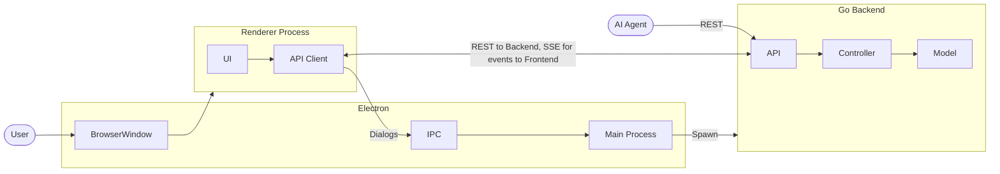
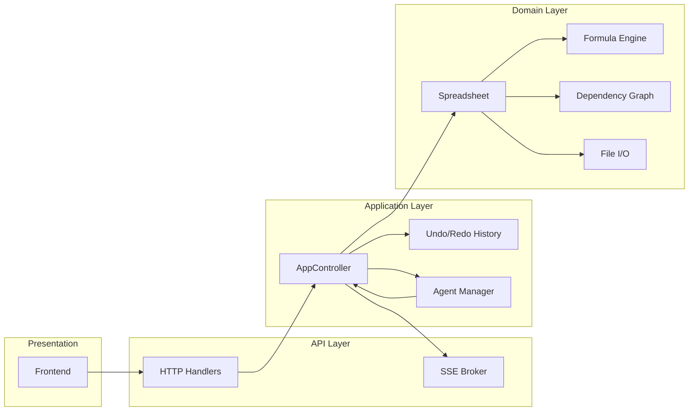
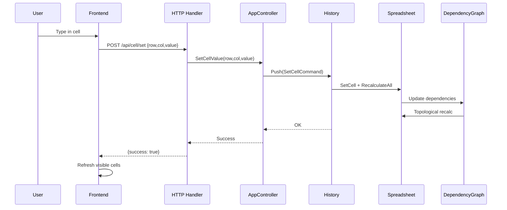
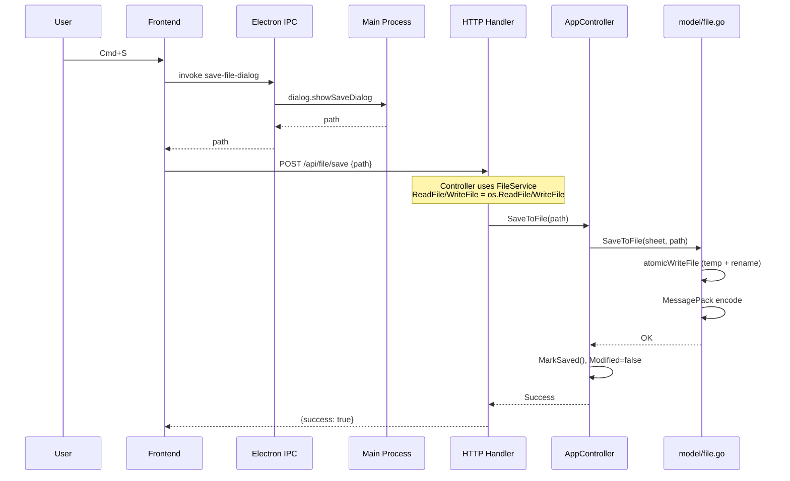
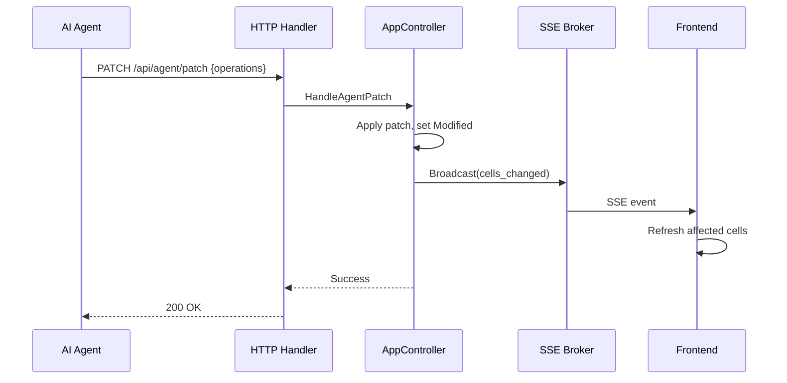
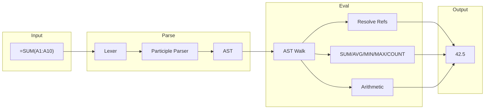

# GoSheet Architecture

This document describes the architecture of GoSheet, a lightweight spreadsheet application for macOS. It covers the runtime stack, component responsibilities, data flows, and key design decisions.

---

## 1. System Overview

GoSheet is a native macOS application built with **Electron** wrapping a **Go HTTP backend** and a **vanilla JavaScript frontend**. All spreadsheet operations flow through a REST API, enabling consistent behavior and comprehensive automated testing.

**Key characteristics:**
- **Single-process Go server** bound to an ephemeral port (e.g. `localhost:3000`)
- **Bootstrap token** authenticates all API requests; Electron injects it into the renderer
- **File dialogs** use Electron IPC; actual I/O is performed by the Go backend via `FileService`
- **SSE** (`/api/events`) pushes real-time updates to the frontend (e.g. agent patch → `cells_changed`)
- **No build step** for the frontend — pure ES6 modules loaded directly

---

## 2. Component Layers

### 2.1 Frontend (`frontend/`)

| Module | Responsibility |
|--------|----------------|
| `app.js` | Main entry, grid setup, event routing |
| `app-grid.js` | Virtualized grid rendering, cell selection |
| `app-cell-editor.js` | In-cell editing, formula bar |
| `app-file-ops.js` | New/Open/Save, IPC for dialogs |
| `app-modals.js` | CSV import, style picker, agent session |
| `api-client.js` | HTTP fetch wrapper, Bearer token injection |
| `app-state.js` | Client-side state (selection, edit mode) |

The frontend detects **Electron mode** via `window.electronAPI` and uses IPC for file dialogs; otherwise it uses the browser File API for web/testing.

### 2.2 API Layer (`api/`)

- **HTTP handlers** map REST endpoints to controller methods
- **Auth middleware** validates Bearer token on `/api/*` routes
- **SSE broker** (`/api/events`) pushes real-time updates (e.g. agent patch → `cells_changed`)
- **OpenAPI** (`api/openapi.yaml`) is the single source of truth; Go types and `api-types.d.ts` are generated. The frontend uses `@ts-check` + `api-types.d.ts`; type checking is enforced in CI via `npm run typecheck`

### 2.3 Application Layer (`controller/`)

- **AppController** holds the spreadsheet, undo/redo history, and agent manager
- **Command pattern** for undo/redo: `SetCellCommand`, `SetRangeValuesCommand`, etc.
- **History** maintains undo/redo stacks (cap 100) and tracks save-point depth
- **AgentManager** issues scoped tokens, tracks sessions, and records audit events

### 2.4 Domain Layer (`model/`)

| Package | Responsibility |
|---------|----------------|
| `spreadsheet.go` | Cells, merges, styles; `GetCell`, `SetCell`, `RecalculateAll` |
| `cell.go` | Cell struct (Value, Computed, IsFormula, StyleId) |
| `formula.go` | Parser (Participle), AST, builtins (SUM, AVG, MIN, MAX, COUNT) |
| `formula_eval.go` | Evaluation, range expansion, error handling |
| `formula_shift.go` | Reference shifting on paste/insert/delete |
| `dependencies.go` | Dependency graph for incremental recalculation |
| `file.go` | MessagePack encode/decode, atomic write |
| `style.go` | StyleRegistry, CellFormat, named styles |

---

## 3. Data Flows

### 3.1 Cell Edit Flow

### 3.2 File Save Flow

### 3.3 Agent Patch Flow (Real-Time Push)

---

## 4. Formula Engine

**Design notes:**
- **Participle** parses formulas into an AST; cell/range refs are first-class
- **Dependency graph** tracks which cells depend on which; `RecalculateAll` uses topological sort
- **Circular reference** detection prevents infinite loops
- **Formula shift** updates refs on paste (relative) and insert/delete rows/cols
- **Absolute refs** (`$A$1`) are preserved during shift

---

## 5. File Format

`.sheet` files use **MessagePack** (v2.0) for cross-language compatibility.

**Top-level structure** (`fileContentV2`): `version` (string "2.0"), `cell_count` (int), `cells` (map: row → col → cellPersist), `merges` (MergeRegion[]), `styles` (StyleRegistry).

**Cell object** (`cellPersist`): `value`, `is_formula`, `is_quote_prefix`, `is_error`, `style_id`. Alignment is in style format, not per-cell.

- **Sparse storage**: only non-empty cells are persisted
- **Computed** is derived on load (not stored)
- **Atomic write**: temp file + `os.Rename` for crash safety
- See `docs/FILE_FORMAT.md` for the full specification

---

## 6. Concurrency and Safety

- **AppController** uses `sync.RWMutex`; all spreadsheet mutations acquire the lock
- **SSE broker** uses non-blocking sends; slow clients are disconnected after 10 missed events
- **Agent sessions** are scoped (read-only or read-write); tokens are CSPRNG, base64url
- **Audit log** writes asynchronously via a buffered channel; `Close()` flushes on shutdown

---

## 7. Testing Strategy

| Layer | Tool | Scope |
|-------|------|-------|
| Model | `go test` | Formula parser, eval, dependencies, file I/O |
| Controller | `go test` | Commands, undo/redo, agent |
| API | `go test` | Handlers, SSE, auth |
| E2E | Playwright | Electron app, menus, dialogs, file ops |
| Chromium | Playwright | Reliable clicks (single, double, shift) |

---

## 8. Key Design Decisions

| Decision | Rationale |
|----------|-----------|
| HTTP API for all ops | Single code path; testable without Electron |
| MessagePack over gob | Cross-language; Python/JS/Rust can read `.sheet` |
| Command pattern for undo | Reversible ops; save-point tracking |
| Ephemeral port | No fixed-port conflicts; Electron reads port from fd 3 |
| Bootstrap token | Simple auth for localhost-only server |
| SSE for agent push | Real-time UI updates without polling |
